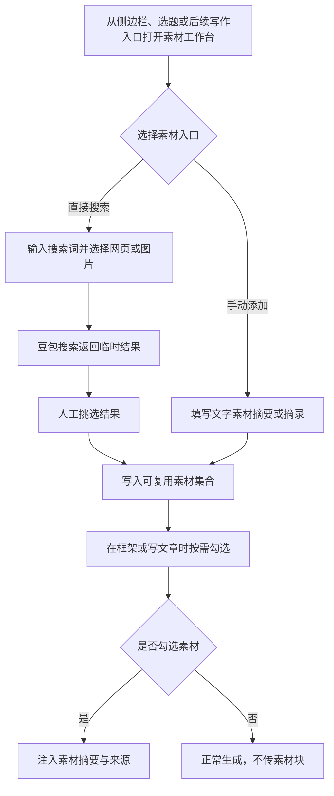

# 素材模块开发 PRD

## 一、业务流程图



## 二、页面说明

### 2.1 模型网关 · 搜索服务连接

**入口来源**

- 模型网关页新增“搜索服务”分区。
- 素材工作台未配置搜索服务时，点击“配置豆包搜索”进入该分区。

**页面元素与交互**

- **豆包搜索 Custom 版连接**
  - 展示：服务名称、固定接口地址、API Key 密码框、连接状态、最近一次测试结果。
  - 交互：输入 API Key 后点击“加密保存” -> Key 使用现有本机加密机制保存；再次打开仅显示掩码。
  - 交互：点击“测试连接” -> 使用一次最小网页搜索验证鉴权和搜索权限；提示测试会消耗一次搜索额度。
  - 状态：未配置时素材搜索按钮不可用；已配置时可发起搜索；测试失败时保留已填内容并显示可读原因。
  - 失败处理：`10406` 显示免费额度已耗尽；`10412` 显示套餐额度不足；`700429` 显示请求过快并提示稍后重试；鉴权或权限错误提示检查 API Key 与搜索服务开通状态。

### 2.2 素材工作台

**入口来源**

- 侧边栏“素材库”。
- 选题详情的“搜集素材”入口，自动带入选题主题，但用户可修改后再搜索。
- 后续框架、写文章页的“选择素材”入口，以抽屉方式打开并支持返回原页面。

**页面元素与交互**

- **上下文栏**
  - 展示：当前可选关联选题；未从选题进入时为空。
  - 交互：可清除关联或更换为任意选题；关联仅用于预填搜索词和溯源，不限制素材的后续复用。

- **搜索区**
  - 展示：搜索词输入框、网页/图片切换、搜索按钮；展开后可设置时间范围、限定站点、权威度和返回数量。
  - 交互：用户直接输入一个搜索词后发起请求，不调用 AI 拆词。
  - 约束：搜索词长度 1–100 字符；网页默认返回 10 条、最多 50 条；图片默认返回 5 条、最多 5 条；同一工作台同时只允许一个搜索请求。
  - 请求规则：网页搜索请求 `NeedUrl=true`、`NeedContent=true`；结果仅消费并保存 `Summary`，不保存或注入 `Content` 全文。图片搜索保存缩略图信息和来源链接。
  - 状态：搜索中禁用重复搜索；搜索完成后结果停留在本次搜索区，未被挑选的结果不会写入素材集合。
  - 失败处理：失败时保留搜索词与筛选条件，显示重试入口；无结果时提示修改关键词、时间或站点范围。

- **网页结果列表**
  - 展示：标题、站点、发布时间、权威度、相关性、`Summary`、原文入口和“加入素材”按钮。
  - 交互：点击标题或原文入口 -> 使用系统浏览器打开来源 URL；点击“加入素材” -> 以当前标题、Summary、来源、站点和搜索词创建网页素材快照。
  - 状态：已加入的结果显示“已在素材库”；相同来源 URL 不重复创建，可打开已有素材。
  - 约束：Summary 为空的网页结果不可加入，提示用户查看原文或更换搜索条件。

- **图片结果网格**
  - 展示：缩略图、标题、站点、落地页、尺寸、形状、水印标识及“授权需自行确认”提示。
  - 交互：点击“加入素材” -> 创建图片参考素材；点击来源 -> 打开图片落地页。
  - 状态：已加入时不可重复加入。
  - 约束：图片素材默认不进入框架或写文章模型的 `<素材>`；它只供创作者浏览，以及后续配图模块选作视觉参考。图片没有自动商用授权结论。

- **手动添加文字素材**
  - 交互：点击“添加文字素材” -> 打开录入面板。
  - 展示：标题、提供给 AI 的摘要/摘录、来源 URL（可空）、来源说明（可空）、关联选题（可空）。
  - 交互：填写后点击“加入素材库” -> 创建手动文字素材；摘要/摘录直接成为下游 AI 可引用内容。
  - 约束：标题与摘要/摘录必填；摘要/摘录最多 3,000 字；来源 URL 为空时标记为“个人整理”，不伪造外部来源。
  - 失败处理：保存失败时保留已填写内容；重复提交期间按钮禁用。

- **我的素材集合**
  - 展示：网页、图片、手动文字三类素材的统一纵向列表；每条显示类型、标题、摘要/来源信息、关联选题数、加入时间。
  - 交互：支持按素材类型、来源站点、关联选题、加入时间筛选；支持标题、摘要和站点的轻量包含筛选；不建立全文索引。
  - 交互：每条可查看详情、编辑手动文字素材、打开来源、删除；删除前提示该素材被哪些下游产物引用，确认后保留下游产物并将其引用标为已失效。
  - 状态：无素材时展示两个主入口：“搜索网页/图片”和“添加文字素材”。

### 2.3 素材详情与下游选择抽屉

**入口来源**

- 素材集合列表点击某条素材。
- 框架或写文章工作台点击“选择素材”。

**页面元素与交互**

- **详情**
  - 网页素材展示保存时的 Summary 快照、来源、站点、发布时间和原文入口；不展示或加载全文 Content。
  - 手动文字素材展示摘要/摘录、来源说明和可编辑内容。
  - 图片素材展示缩略图、来源页、尺寸、水印标识和版权提醒。

- **下游选择抽屉**
  - 展示：当前已选素材列表与素材集合筛选列表，支持勾选多条网页或手动文字素材。
  - 交互：确认选择 -> 返回来源工作台并显示已关联数量；取消 -> 不改变来源工作台已有选择。
  - 约束：图片素材不出现在文字 AI 的可勾选列表；允许选择 0 条。
  - 状态：选择 0 条时“继续生成”仍可用，且明确提示将以无素材模式生成。

## 三、素材导入结构

### 3.1 统一素材对象

| 字段 | 规则 |
|---|---|
| 素材类型 | `web`、`image`、`text` |
| 导入方式 | `doubao_web`、`doubao_image`、`manual_text` |
| 标题 | 必填；来自搜索结果或人工填写 |
| AI 摘要/摘录 | 网页取豆包 `Summary`；手动文字由用户填写；图片为空 |
| 来源 URL | 网页与图片必填；手动文字可空 |
| 来源站点/说明 | 搜索结果自动保存；手动文字可填写 |
| 搜索词 | 豆包搜索导入时保存；手动文字为空 |
| 关联选题 | 可空的软引用，可后补，不限制跨选题复用 |
| 搜索快照元数据 | 网页保存发布时间、权威度、相关性；图片保存尺寸、形状和水印标识 |
| 创建时间 | 本地写入时间 |

### 3.2 下游文本契约

- 仅当用户勾选至少一条网页或手动文字素材时，向框架/写文章模型注入 `<素材>`。
- 未勾选时整个 `<素材>` 块省略，不传空标签。
- 每条素材以标题、摘要/摘录、来源组成；来源 URL 用于引用溯源，不指示模型访问网页。

```text
<素材>
条目 1：
标题：AI Agent 真正落地的三道坎
摘要：……
来源：https://example.com/article

条目 2：
标题：访谈摘录
摘要：……
来源：个人整理
</素材>
```

## 四、待确认事项

- 第一版不支持 Markdown、PDF、Word 文件导入；如需文件导入，后续作为独立入口增加，不能把文件全文直接作为 AI 上下文。
- 网页原文全文只在浏览器原站查看；本地素材库保持 Summary 快照，不作为网页存档或转载工具。
