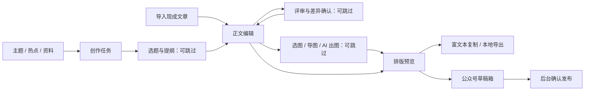

# 墨流：用户创作体验审查与优化方案

审查日期：2026-09-20。对象：本工作区当前版本的 Electron 桌面应用、12 个页面、主进程服务、数据契约、现有 PRD 和测试。

## 1. 核心结论

**目前已经有覆盖多个创作阶段的功能骨架，但还没有形成足够简单、连续、可靠的用户创作工作台。配置完成并不等于可以顺畅创作；服务链路能够落库，也不等于用户能够顺利得到可发布成品。**

当前适合内部试用、验证模型和单环节能力；不建议在修复正文编辑、未保存内容保护和排版错稿问题前，宣称已具备稳定的完整创作体验。

| 用户关心的问题 | 判断 | 主要原因 |
|---|---|---|
| 操作便捷性是否 OK？ | 基本入口清楚，日常操作仍偏复杂 | 用户面对的是模块菜单，需要重复找产物、选上下文和处理技术参数 |
| 配置完是否足够简单？ | 尚未达到 | 配置状态不等于验证状态；模型、搜索、公众号分别配置；日常写作仍暴露大量设置 |
| 流程是否顺畅？ | 局部可用，跨环节不连续 | 未统一传递当前作品、来源版本和返回位置；补素材可能丢失原页面输入 |
| 创作路径是否覆盖？ | 标准文字生成链路部分覆盖，成品交付与非标准入口缺口明显 | 现成文章导入、真实图片、图文组装、富文本复制、备份恢复不足 |
| 问题能否解决？ | 大部分可以在现有架构上解决 | 核心在状态和数据契约、成熟编辑器、排版内核及面向作品的交互，无需整体推倒 |
| 是否应借鉴开源？ | 应当，且编辑器和排版应优先 | 现有逐行 Markdown 转换和手工 contentEditable 已经产生真实缺陷 |

**建议先兑现四个承诺：写不丢、改得明白、流程不断、交付能用。**

## 2. 证据与审查边界

### 2.1 已完成的验证

- 阅读实际路由、12 个页面的核心交互、生成/评审/配图/排版/发布服务、IPC 和数据契约，结合相关 PRD 与 ADR 判断。
- `npm.cmd test`：13 个测试文件、71 项测试通过。
- `npm.cmd run build`：类型检查和生产构建通过。
- 使用隔离的临时 `userData` 运行 Electron，创建审查用账号、文章、排版稿；没有修改用户真实创作库。
- 定向操作验证了 11 个页面的标题与默认视口下文档级横向溢出；这 11 页未发现文档级横向溢出。此项不代表所有内层控件或缩放场景通过。
- 另行打开热点页：新装状态可加载；短时采样显示部分源成功、部分源失败，页面提供单源重试。没有把短时采样当成整体服务可用率。
- 使用本地模拟服务返回 HTTP 401，验证配置后的连接失败和评审失败体验；未使用真实模型密钥，未进行真实公众号推送。
- 查看本次生成的编辑器、工作台和配置页面截图，确认界面层级与主要信息布局。
- 检索并核验开源项目官方仓库、文档及 npm 元数据，区分“候选”“建议试点”“已接入”。本次未安装新的产品依赖。

### 2.2 限制

这是一份基于实际实现和定向运行的产品体验审查，不是真实用户访谈或完整可用性实验。目标用户暂按“个人创作者、小团队账号运营者，主要产出中文图文内容”假设；该假设来自项目定位和需求文件，仍需访谈验证。

没有验证真实模型输出质量、所有热榜长期稳定性、真实微信后台粘贴效果、真实账号权限、发布回执，以及所有 Windows 缩放比例和中文输入法。没有执行生产发布，也没有声称通过全链路真人验收。

原有 `smoke-ui-audit.mjs` 本次长时间未结束，已停止，不能用目录中旧的巡检报告宣称本次通过。配置态探针最后进入热点页的步骤超时；独立的新装热点探针随后成功，配置态热点路径仍列为待复查，未据此直接判定热点页普遍崩溃。

本次新增的只有报告、审查脚本和证据产物；未修改应用业务源码。现有构建输出和部分原巡检截图因验证而刷新。

### 2.3 证据等级

- **R：运行复现**——在隔离 Electron 实例中实际操作得到结果。
- **C：代码确认**——实现直接支持该判断，但未做对应真实外部系统联调。
- **D：需求差异**——PRD、ADR 或产品承诺与当前实现不一致；不自动等同程序缺陷。
- **H：待验证假设**——需要用户测试、真实服务或业务决策确认。

## 3. 从实际用户需求出发：用户究竟在完成什么

用户的任务是：“把一个想法、资料或已有稿件，变成符合账号表达、自己愿意发布、格式可用的内容，并在下次继续使用已有积累。”

对应六个基本需求：

1. **容易开始**：有想法、有热点、有资料、有现成文章，都能进入。
2. **减少重复劳动**：同一账号、作品、模型偏好和素材不用反复选择。
3. **保有控制**：知道 AI 正在改什么，能接受、拒绝、比较和恢复。
4. **避免损失**：临时切页、断网、失败和重启，不应让投入消失。
5. **交付有效**：得到真正能复制、导出或推送的图文成品。
6. **积累复用**：找得到历史作品、素材、版本和发布记录。

因此，建议用以下成本模型判断优化价值：

> 完成一篇可发布内容的总成本 = 做决定的成本 + 重复输入/查找成本 + 等待成本 + 失败后的恢复成本 + 外部搬运成本。

减少点击只是其中一小部分。例如，把“锁定”少点一次，却让用户丢了半小时正文，不构成体验改善；配置更多模型，也不能弥补不会带入当前文章的页面。

## 4. 用户路径覆盖审查

| 真实场景 | 当前覆盖 | 关键缺口 | 建议目标 |
|---|---|---|---|
| 新用户配置后写第一篇 | 部分覆盖 | 配置术语多；首页继续引导账号设置；没有明确的首次成功任务 | 保存并验证文本模型后，直接“写第一篇” |
| 从热点找角度并成文 | 部分覆盖 | 热点收藏能关联到选题，但关键词仍要填写；选题到框架还需重新找对象 | 从所选热点创建作品，带入主题和出处 |
| 已有明确主题，直接写 | 部分覆盖 | 文章允许手动框架；选题 AI 却要求锁定账号 | 提供“直接写”，账号可选，必要时后台生成可跳过的提纲 |
| 有资料，想整理成文 | 部分覆盖 | 有手动文字素材和搜索摘要；写作只能从前 10 条素材中勾选 | 全量可搜索的素材选择器，保留返回上下文 |
| 已有完整文章，只想润色/评审 | 明显不足 | 主进程支持保存新文章，但页面没有直接新建/粘贴成稿入口 | 粘贴文本/导入 Markdown 后直接进入编辑和评审 |
| 写到一半补资料，稍后继续 | 不可靠 | 页面局部状态丢失，正文未保存切页会丢 | 自动草稿、恢复位置、抽屉补素材 |
| 多角色评审再改稿 | 部分覆盖且有风险 | 全失败也报完成；任务未绑定文章版本；没有清晰差异预览 | 逐角色状态、基线版本、逐条采纳、差异确认 |
| 图文文章最终交付 | 未闭环 | 配图只输出提示词；缺本地图片资产到排版的链路 | 选图/导图/出图→定位→排版→预览→导出 |
| 微信公众号发布 | 部分覆盖 | 要手填封面媒体 ID；需后台确认；状态由人工补链接 | 先完善可复制成品，再提供选封面→上传→推送草稿 |
| 小红书图文 | 仅文案适配 | 目前主要是标题/小标题的文本转换，无完整图文资产交付 | 作为后续单独平台能力，不与“已支持发布”混淆 |
| 多账号日常运营 | 基础数据存在，隔离体验不足 | 各模块列出全局产物；写作默认账号可能与框架账号不一致；发布通道单一 | 默认按账号查看，作品显式绑定账号，跨账号复用显式提示 |
| 历史复用、迁移、发布复盘 | 局部覆盖 | 有版本和发布记录；缺面向用户的整库备份恢复与运营反馈入口 | 先补备份/导出和查找；复盘按真实需求后置 |

“从任意环节开始”与“提供推荐顺序”可以同时实现：系统给新手一条推荐路径，熟练用户可以跳过选题、框架或配图。不要为了流程一致强迫每篇文章经过全部模块。

## 5. 优先处理的问题清单

优先级定义：P0 为发布前必须消除的正文损失、核心编辑阻断或错稿风险；P1 为高频流程阻碍、状态误导和成品交付缺口；P2 为效率、规模与后续能力。优先级不是安全漏洞等级。

### F01｜P0｜可视编辑输入一次后失去焦点【R/C】

**复现**：打开文章 A 的可视编辑，将光标移到末尾，连续输入 `XYZ`。结果只留下 `X`，编辑器不再拥有焦点。

**原因**：`RichMarkdownEditor` 使用 `key={markdown}`；每次输入改变 Markdown，都会替换可编辑 DOM。`htmlToMarkdown` 又重新拼接段落，放大重建和排版漂移。

**用户影响**：核心写作动作不能稳定完成。中文输入法组合、撤销等也需要专项测试，不能认为修掉一次失焦就全部解决。

**处理**：先停止随正文变化重建编辑节点；以成熟编辑器替换当前逐行转换。优先做 Milkdown 与 Tiptap 的小样对比，选择一个，不同时引入两套文档状态。

**验收**：连续中文/英文输入、换行、粘贴、撤销重做和模式切换不丢字、不跳焦点；非用户主动切换时光标保持；样例文档往返保存不丢链接、图片和列表。

证据：`ArticlesPage.tsx:110`，运行记录 `rich-edit-focus`。

### F02｜P0｜正文未保存切换页面后丢失；AI 改稿也不消费屏幕上的临时修改【R/C】

**复现**：在 Markdown 源码中写入“未保存的关键编辑”，切到排版页再返回文章 A，文本恢复为数据库原稿。

**原因**：`draft` 只存在组件状态中；路由卸载后消失。切换文章时也会重设 `draft`。AI 改稿只传 `articleId`，服务读取已保存正文。

**处理**：建立独立的工作草稿，自动保存输入并显示“正在保存/已保存/保存失败”；路由切换、关闭和发起 AI 前处理脏状态。AI 改稿明确基于当前工作草稿还是某个已保存版本。不要把每个按键都生成一条正式历史版本。

**验收**：输入后切页、切文章、补素材、重启均能恢复；保存失败仍保留缓冲；AI 改稿包含用户刚改的内容；历史基线不被静默覆盖。

证据：`ArticlesPage.tsx:35`、`:58`、`:74`；`article-generator.ts:38`，运行记录 `unsaved-navigation`。

### F03｜P0｜排版页选文章 B，预览仍是文章 A【R/C】

**复现**：A 有排版稿，B 没有；进入排版页，将文章选择改为 B。左侧列表为空，右侧标题仍为 A，复制/删除动作仍作用于旧选中对象。

**原因**：侧栏按 `articleId` 过滤，而 `selected` 从全局 `layouts` 按 `selectedId` 获取；切换文章没有同步选中排版稿。

**处理**：将选中态限制在当前文章的排版集合内；切换文章时选择对应最近稿或清空。复制、删除、推送前再核对作品、文章版本和排版稿归属。

**验收**：A→B→A、无排版稿、删除当前稿、切平台均保持对象一致；任何导出都显示实际导出的文章标题。

证据：`LayoutsPage.tsx:8`，运行记录 `layout-selection`。

### F04｜P1｜排版没有正确支持常用 Markdown【R/C/D】

**复现**：正文包含加粗、来源链接、图片和表格，生成排版稿。输出没有 `img`、链接或表格节点，`**重点**` 仍作为字面文字保留。

**原因**：`article-layout-service.ts` 自行逐行转换，只覆盖少数块级语法。不是完整 Markdown 解析器，也没有消费真实配图资产。

**处理**：采用成熟解析与公众号渲染实现，编辑、预览和导出使用明确的一套文档语法合同。保留现有 HTML 清理，避免把解析器当安全过滤器。

**验收**：固定样例覆盖标题、段落、强调、链接、图片、列表、引用、表格、代码块；不支持的语法明确提示；预览、复制和导出一致。真实公众号兼容性另外验收。

证据：`article-layout-service.ts:14`，运行记录 `layout-markdown`；《PRD-排版AI》原已提出复用开源渲染。

### F05｜P1｜“不使用账号定位”无法保持【R/C】

**复现**：已有账号时，在文章页选择“不使用账号定位”，实际值立即变回某个账号 ID。

**原因**：effect 把空字符串同时当作“尚未初始化”和“用户主动不选”。框架页有同类代码。

**处理**：分清未初始化、用户主动清空、所选对象被删除三个状态；只在初始化时填默认值。选择框架时，若其账号与当前写作账号不同，应提示继承/覆盖，而非静默保留旧值。

**验收**：主动不选能保持；切换框架不会悄悄混入另一个账号；作品标题附近显示真正参与生成的账号。

证据：`ArticlesPage.tsx:49`、`:60`；`FrameworksPage.tsx:60`，运行记录 `optional-account`。

### F06｜P1｜连接测试失败，仍显示“网关可用”【R/C】

**复现**：配置本地模拟供应商，服务返回 401。连接测试显示失败，但侧栏仍显示“网关可用”“已就绪”，供应商卡片仍为“可用”。离开再回来，临时测试提示也会丢失。

**原因**：就绪条件仅为 `enabled && hasApiKey`，测试结果只在页面状态中。

**处理**：区分已保存、未验证、最近验证成功、验证失败、已停用；把失败原因和最后验证时间持久化。配置修改后使旧验证结果失效。文本、搜索、图像、发布分别显示能力就绪状态。

**验收**：错误 Key、模型不存在、超时、限流、搜索额度不足有对应行动；不会用“已保存”冒充“已连通”。不要求用户每次创作重新测试。

证据：`Layout.tsx:71`、`ProvidersPage.tsx:181`、`:288`，运行记录 `gateway-failed-but-ready`。

### F07｜P1｜所有角色评审失败，却提示“评审完成”【R/C】

**复现**：模拟模型返回 401，选一个评审角色并开始。界面提示“评审完成”；数据库任务为 `completed`，意见列表为空。

**原因**：服务返回 `{task, failed}`，页面忽略 `failed`。任务在创建时就标为 completed。空解析结果也缺少清晰解释。

**处理**：任务和角色各自保存 running/succeeded/partial/failed 状态；页面展示成功数和失败数、原因、仅重试失败项。区分“审完没有问题”和“没有得到有效意见”。

**验收**：全失败不得显示成功；部分失败保留有效意见；零问题有明确结论；切页回来仍能看到失败原因。

证据：`ReviewsPage.tsx:16`；`review-service.ts:10`；`database.ts:1285`，运行记录 `review-all-failed`。

### F08｜P1｜已有上下文没有转化成省事的预填【R/C/D】

**复现**：按现有交接机制把选题 ID 带入素材页，关联选题已选中，但搜索框仍为空。

热点→选题也只带收藏 ID；`seedKeyword` 没有从收藏初始化，生成时却要求填写关键词。用户明明选好了对象，仍需重新组织相同信息。

**处理**：交接上下文包含对象 ID、标题、关键词、来源版本和返回位置；首次进入预填，用户修改后尊重修改，避免异步刷新覆盖。

**验收**：从单选题搜索无需重输主题；从指定热点生成选题无需复制标题；从素材抽屉返回恢复原稿与选择。

证据：`TopicsPage.tsx:60`、`:317`；`MaterialsPage.tsx:51`、`:54`，运行记录 `topic-material-prefill`。

### F09｜P1｜“流水线总览”没有总览正在创作的内容【C/R】

首页仍展示首期“网关+账号”、2 项完成度和账号定位宣传。即使有文章和评审，首页仍主要指向账号设置。完成度以账号数量判断，而文案写“生成并锁定”，含义也不一致。

**处理**：首次使用显示设置；设置完成后显示“继续上次作品”、最近作品、需要处理的任务、待交付稿。“下一步”根据当前作品实际缺口推荐。

**验收**：配置完成用户进入首页，一次操作回到上次作品；存在未完成任务时能直接定位。

证据：`DashboardPage.tsx:29`、`:38`、`:58`；本次 `dashboard.png`。

### F10｜P1｜模块齐全，但缺统一的“当前作品”【C】

`App` 主要传页面路由与全局账号，后续页面独立列出文章并自行选择。已有热点→选题、选题→素材的局部交接，但框架→成稿→评审→配图→排版→发布没有统一的作品上下文。用户要记住标题和版本，容易选错同名稿件。

**处理**：先以文章/创作任务为聚合入口，保留现有模块服务；增加稳定作品 ID、上下文路由和统一页头。无需先造庞大工作流平台。

**验收**：从当前框架开始写作后，进入评审、配图、排版默认仍是这篇作品；用户随时可以显式切换。

证据：`App.tsx:48`；`ArticlesPage.tsx:21`；后续各页的 `articleId` 初始化与 `refresh`。

### F11｜P1｜真实图片到排版的链路没有实现【C/D】

“智能配图”实际只生成封面、文内图和发布图的提示词，并且页面内已经说明这一点。用户仍需去外部绘图、下载、管理文件，再自行组装。原配图 PRD 定义了真实图片生成、本地资产和配图位置。

**处理**：分两步：先允许导入/选择现成图片并与正文位置绑定，完成图文交付；再接图像生成，提供单图重试和候选选择。没有图像服务时，保留“选本地图”路径。

**验收**：用户能把一张封面和两张正文图放进最终排版并导出；图片与具体文章版本、段落位置、来源关联。无需配置图像模型也能完成图文文章。

证据：`VisualsPage.tsx:17`；`visual-pack-generator.ts:15`；《PRD-配图三件套》。

### F12｜P1｜复制功能不能完成“带样式粘贴”【C/D】

当前两个按钮分别以 `navigator.clipboard.writeText` 写入发布文本、HTML 字符串；后者是源码，不是剪贴板的 HTML 富文本格式。用户仍需额外打开 HTML 或外部工具处理。

**处理**：提供“复制到公众号”主按钮，通过受控主进程剪贴板接口同时写入 HTML 和纯文本；保留“复制源码”为高级操作；补本地 Markdown/HTML+图片导出。

**验收**：剪贴板实际具有 HTML 格式；粘贴到测试编辑器保持样式；最后再做真实微信后台回检。真实结果未验证前不能标为“一键可发布”。

证据：`LayoutsPage.tsx:11`、`:13`。

### F13｜P1｜公众号封面操作仍要求开发者知识【C】

发布页要求手填 `thumb_media_id`，提示先到公众号素材库上传。凭据 AppID/AppSecret 可能一次性配置，但每篇内容都找媒体 ID 不适合作为创作者默认路径。现有服务支持草稿箱推送和手动登记发布链接，不是正式自动发布。

**处理**：让用户选择封面，应用处理上传、缓存媒体映射、预览并推送。默认提供复制/导出，即使发布通道不可用也能交付。保留“去公众号后台发布”的明确边界。

**验收**：每篇推送只需选稿、选封面、确认；常见权限/网络错误可理解；推送不确定时提示核查草稿，避免用户反复点击生成重复草稿。

证据：`PublishingPage.tsx:7`；`wechat-publish-service.ts:8`。当前单一 `wechat-official` 通道与多创作账号需要明确映射。

### F14｜P1｜评审意见没有绑定准确稿件版本，应用改稿缺少差异确认【C】

`ReviewTask` 只有文章 ID，没有受评版本 ID；应用时读取文章当前内容。若评审后文章已经修改，旧位置和旧建议仍会用于新稿。页面展示全局任务，标题主要是“评审任务”，不足以识别文章、版本和时间。

**处理**：评审固定 `articleVersionId`；应用前校验版本。过期时允许重新评审，或让用户明确选择如何应用；输出新候选，展示差异后确认，保留原版本。任务列表按作品筛选并显示文章标题和版本。

**验收**：评审 V1→编辑成 V2→应用旧建议时不能静默覆盖；用户看得见改动段落；已应用任务避免不知情重复执行。

证据：`contracts.ts:480`；`review-service.ts:12`；`ReviewsPage.tsx:18`。

### F15｜P1｜临时任务、失败与重试没有统一恢复机制【C】

生成忙碌状态主要是页面内布尔值；路由离开后不保留任务视图。网关已有超时与有限重试，但用户看不到明确阶段、持久结果或“仅重试失败项”；也没有贯穿 IPC 的用户取消契约。退出应用时未发现任务恢复设计。

**处理**：任务在主进程执行、SQLite 持久化，页面订阅状态。先支持等待、执行、部分成功、失败、中断；取消与自动重试根据操作类型制定，外部发布不盲目重试。

**验收**：长任务切页可继续看进度；重启后中断任务可辨认；失败原因保留；批量只补失败项；新任务不会覆盖用户等待期间的手工修改。

证据：`model-gateway.ts:123`、`:130`；`preload/index.ts`；各生成页的局部 `generating/busy`。

### F16｜P1｜缺少现成文章入口，且选题锁定门槛需重新评估【C/D】

成稿保存 API 支持无 ID 新建，但用户页只提供先生成文章再编辑的主路径。选题生成严格要求锁定账号，这是 ADR 0006 的明确决定，因此不能当成偶发 bug；但它与“已有主题快速开始”的需求有冲突。

**处理**：提供“粘贴文章”“导入 Markdown”“直接写”；账号未锁定时说明使用草稿快照，是否放开选题限制需要形成新的明确产品决定。保留专业用户固定基线能力。

**验收**：无需调用模型即可导入文章、编辑、排版；无账号也能先写；新用户不会误以为必须完成七问才能使用一切功能。

证据：`ArticlesPage.tsx:64`、`:99`；`contracts.ts:474`；`docs/decisions/0006-topic-generation-contract.md`。

### F17｜P2｜素材越多，写作时反而选不到需要的资料【C】

文章素材选项使用 `usableMaterials.slice(0, 10)`，没有对应的全量搜索/展开入口。素材库自身有检索，但返回后不能把选中素材直接带回原文。关联记录已有基础，但不是逐段事实证据。

**处理**：共用可搜索的素材抽屉，支持已选置顶、筛选、摘要预览和返回；加入按文章查看引用来源。正文质量要求较高时，增加“关键论断→证据摘录→原文来源”的轻量链路。

**验收**：第 11 条、第 100 条素材都可找到并引用；选中集合准确；搜索摘要和已核实原文明确区分。

证据：`ArticlesPage.tsx:98`；`MaterialsPage.tsx:84`；`article-generator.ts:183`。

### F18｜P2｜本地优先缺少面向用户的备份与迁移闭环【C】

已有 SQLite 和版本历史，但检查到的 UI/IPC 没有整库备份、恢复、迁移和回收站入口。版本历史能撤销内容变化，不能代替设备损坏或数据库丢失后的恢复。

**处理**：导出作品包与整库备份分开；备份包含数据库版本、素材清单和文件校验；恢复前检查、先备份当前库。新设备重新配置密钥，避免将本机加密内容当作天然可迁移凭据。

**验收**：在干净测试目录恢复完整作品、图片和来源；有备份版本检查；从失败恢复中不破坏原库。

证据：`README.md`、`contracts.ts` 的 `MoliuApi`、`preload/index.ts`。

### F19｜P2｜技术术语和页面层级占用了创作注意力【C/R】

页面频繁出现 Renderer、DPAPI、Summary、System prompt、XML、API 模型 ID 等。多数是实现概念。侧栏素材序号 06 排在 10 后，既像流程又不按流程排序。文章页在编辑区之前放较大生成表单，持续写作时仍需滚动。

**处理**：保留现有紫色品牌、按钮和整体布局基础；把技术说明放高级设置或帮助，正文使用“参考摘要”“AI 服务”“评审要求”等任务语言。编辑中收起生成配置，强化正文与保存状态；导航按作品、素材、账号、设置组织。

**验收**：用户能解释每个主要按钮将做什么；已有稿件默认看到编辑器；默认窗口与 125%/150% 缩放下关键操作可达。

证据：`Layout.tsx:32`；`ProvidersPage.tsx`；`ArticlesPage.tsx:97`；本次截图。Electron 最小宽度 1180，不能把 CSS 中更小断点等同真实桌面分屏验收。

### F20｜P2｜页面异常和外部链接处理不统一【C/H】

部分复制、删除、采纳评审、标记发布回调缺少局部失败反馈；根页面没有发现统一的渲染错误恢复边界。发布记录使用 `target=_blank` 链接，而窗口策略直接拒绝新窗口；热点/素材则使用白名单 IPC 打开系统浏览器。

**处理**：关键异步操作统一反馈、保留输入与重试；页面级错误边界提供返回和诊断；外部链接统一受控打开。配置态热点超时先补日志复查，避免通过猜测扩大缺陷结论。

**验收**：模拟写入、剪贴板或页面渲染失败，当前作品可恢复；发布记录链接可按预期打开；危险协议被拒绝。

证据：`PublishingPage.tsx:12`；`LayoutsPage.tsx:13`；`ReviewsPage.tsx:18`；`main/index.ts:45`；`ipc.ts:243`。

## 6. 应保留的基础

已有投入值得保留：

- Electron 主进程持有网络、密钥与数据库，renderer 经白名单 IPC 调用；本地持久化和密钥加密已建立。
- 账号、框架、文章等具备版本记录，部分下游保存来源版本/草稿快照；不必从零建立追溯体系。
- 批量生成使用独立调用，失败不会整体回滚成功项。应把这一能力真实反映到界面。
- 热点分批加载、单源失败重试、收藏快照已有价值；不建议重新自研全部热榜采集。
- 素材有搜索和手工添加两条路径，不应把联网搜索设为写作硬门槛。
- Modal、确认框、表单错误、跳过导航和减少动画偏好已有基础。后续应增强真实键盘和缩放验收，而不是重做一套外观。

## 7. 建议的目标交互

### 7.1 首页以正在做的作品为中心

首次使用显示一个主要任务：“连接 AI，开始第一篇内容”；也允许先导入本地文章体验编辑/排版。

配置完成后首页改为：

- 主操作：新建内容。
- 继续上次作品：标题、账号、当前阶段、上次保存时间、下一步。
- 最近作品：按账号/状态筛选，支持搜索。
- 待处理：生成失败、待评审、图片未选、排版过期、待后台发布。

“新建内容”只询问已有输入：从主题开始、从热点开始、从资料开始、导入文章。账号和常用设置自动带入且可跳过。

### 7.2 一篇作品始终在同一上下文中

顶部持续显示作品、账号、版本和保存状态。阶段只是作品中的不同视图；素材作为侧边抽屉，模型作为可折叠选项。人仍负责主题选择、关键事实、改稿采纳和最终发布。

### 7.3 配置用能力而不是供应商数量描述

基础设置默认只显示供应商预设、Key、默认文本模型和“保存并验证”。地址和模型 ID 允许高级展开，不删除自定义网关能力。

文本能力一旦验证，就允许创作。搜索、图像和公众号推送在首次用到时配置；没有这些服务仍有手工素材、本地选图、复制导出作为替代路径。

生成页默认使用账号/工作区偏好，主要保留主题、目标平台、篇幅与“生成”。候选数、推理档位、自定义字段和提示词放高级选项。配置未变时，不反复要求用户确认。

### 7.4 区分工作草稿、历史版本和下游快照

| 层次 | 用途 | 建议行为 |
|---|---|---|
| 工作草稿 | 用户正在编辑 | 自动保存、恢复光标和页面位置；不要求手工锁定 |
| 历史版本 | 用户确认、AI 候选、关键检查点 | 可以比较、恢复、命名，避免每个按键一版 |
| 下游快照 | 评审、图片方案、排版、推送 | 固定文章版本；上游变化后标记过期，不静默重新绑定 |

不应把“锁定”同时表示“禁止编辑”“推荐使用”“已发布”。建议用户侧用“设为定稿/基线”，编辑产生新草稿；发布状态单独管理。

## 8. 开源方案：具体借什么，如何接入

原则是复用已经解决的难题，同时保留本项目本地架构、版本模型和用户控制。开源项目的存在不是完成集成的证据；以下推荐均需要小样与打包验证。

### 8.1 优先选型表

| 能力 | 候选与核验来源 | 适配判断 | 推荐方式与边界 |
|---|---|---|---|
| Markdown 可视编辑 | [Milkdown](https://github.com/Milkdown/milkdown)，MIT；基于 ProseMirror/remark | 高；契合当前 Markdown 存储 | 优先试点正文编辑与源码往返；必须验证中文输入、React 接入、图片和历史恢复 |
| 可扩展富文本 | [Tiptap](https://tiptap.dev/docs/editor/getting-started/overview)，编辑器核心 MIT | 高；适合后续批注、块级操作 | 与 Milkdown 二选一；核心开源不代表云协作和所有高级扩展免费；不要为眼下写作稳定引入不必要服务 |
| 公众号排版体验 | [doocs/md](https://github.com/doocs/md)，仓库 WTFPL | 高；直接对应用户任务 | 借鉴主题、复制、草稿管理、图片处理、导入导出；评估可复用核心，不把整套应用直接塞进 Electron |
| 既定排版依赖核对 | [npm md2wechat](https://www.npmjs.com/package/md2wechat)，registry 本次 latest=2.0.5，声明 MIT | 与既有 PRD 最接近，待工程验证 | 先验证精确包的导出、主题、离线渲染、图片处理和 Windows 打包；仓库来源字段缺失，来源与授权链还需核实 |
| 确定性 Markdown 解析 | [markdown-it](https://github.com/markdown-it/markdown-it)，MIT | 高 | 若完整排版包不适合，就复用解析器+内联样式组合；不再自写逐行语法解析 |
| 工作流状态 | [XState](https://github.com/statelyai/xstate)，MIT；[持久化文档](https://stately.ai/docs/persistence) | 中高 | 在主进程编排生成/取消/重试状态；SQLite 仍负责持久化，不能以引入状态机代替任务日志 |
| 页面数据同步 | [TanStack Query](https://github.com/TanStack/query)，MIT | 中高 | 统一 IPC 查询缓存、失效刷新和页面加载状态；它不替代作品业务状态或数据库 |
| 改稿差异 | [jsdiff](https://github.com/kpdecker/jsdiff)，BSD-3-Clause | 高 | 为版本对比提供基础文本差异；中文段落分割、图片移动和用户采纳仍由产品设计 |
| 网页正文摘取 | [Mozilla Readability](https://github.com/mozilla/readability)，Apache-2.0 | 有条件 | 用户明确收集原文时提取正文，并继续做 HTML 清理；不是搜索引擎、不能保证动态/受限页面抓取成功 |
| 可替换联网搜索 | [SearXNG](https://github.com/searxng/searxng/blob/master/README.rst)，AGPL-3.0 | 有条件，后置 | 作为自托管可选搜索适配器；需要部署维护和质量验证，不作为普通用户首次安装的默认负担 |

上述“适配判断”为本报告结合现有 React/Electron/SQLite 结构作出的工程判断，不是已完成兼容测试。

### 8.2 特别注意 md2wechat 的同名问题

现有排版 PRD 明确要求使用开源 `md2wechat`，当前代码却没有该依赖，而是自行渲染。应该先把这项既定复用决策落实为可运行的小样，不能继续仅在文档中标注“已决定”。

本次查询 npm registry：无作用域包 `md2wechat` 的 latest 为 2.0.5，元数据声明 MIT，具有库入口和 ESM import 导出；README 描述 Markdown、主题、样式内联与图片上传。元数据中的 repository 为空，尚未核验实际包文件、授权来源和所有 API。证据保存在 `md2wechat-registry.json`。

另一个常见结果 [geekjourneyx/md2wechat-skill](https://github.com/geekjourneyx/md2wechat-skill) 使用带作用域的 npm 安装入口，官方说明 npm 包封装发布二进制；它不能仅因名字相似就视为原 PRD 的进程内库。[官方安装说明](https://www.md2wechat.com/blog/md2wechat-2-0-6-release)

其当前 LICENSE 为基于 BUSL-1.1 的 Source Available License，包含商业使用限制；不能沿用“当前版本是 MIT、可直接商用接入”的假设。许可证还专门区分历史 MIT 版本。[当前 LICENSE](https://github.com/geekjourneyx/md2wechat-skill/blob/main/LICENSE)

**推荐决策顺序**：先验证原 PRD 指向的精确 npm 包；来源、接口、离线能力或兼容性不满足时，记录新的 ADR，转向 doocs/md 的可复用能力或 markdown-it 组合。锁定确切版本、来源与许可证，不按搜索结果名称选依赖。

### 8.3 借鉴完整产品时，提取行为而非堆技术

doocs/md 的本地草稿自动保存、文件导入导出、主题和图片工作流，是最直接的对照对象。应当用同一篇真实图文，比较本项目与它完成任务需要的重复输入、外部搬运和格式修复步骤。[项目说明](https://github.com/doocs/md)

markdown-nice 也是排版交互参考，但仓库为 GPL-3.0。参考其用户任务安排与直接复制实现是不同事情，不能默认按宽松许可嵌入。[仓库](https://github.com/mdnice/markdown-nice)

暂不建议为当前桌面单人创作引入大型通用编排平台、协作后端或向量数据库。当前多数问题是已有上下文没有正确传递、编辑器不稳、输出不完整，增加基础设施不能自动解决它们。只有出现清晰的团队协作、语义检索或复杂运行需求时再评估。

### 8.4 每个候选都用真实样稿做短周期验证

建议用 1–2 个工程日完成一项最小选型实验，此为预算建议而非交付承诺：

- 输入同一篇含中文、链接、图片、列表、表格和代码块的文章。
- 在 Electron 中实际输入、保存、撤销、重启、复制和导出。
- 断网检查哪些能力仍工作，避免无意引入远程服务依赖。
- 核实精确许可证、依赖树、资源文件、主进程边界和 Windows 打包方式。
- 记录通过/失败及放弃原因；选定后只维护一个文档规范和一个渲染入口。

## 9. 分阶段优化路线

### 阶段 A：先保护已经投入的内容

范围：F01、F02、F03、F05、F06、F07、F14 的基本版本校验，以及错误恢复的必要部分。

交付：稳定编辑、自动草稿/离开保护、正确对象选择、真实任务状态、评审基线。首页和新功能可以稍后。

**退出标准**：连续输入不丢字；切页不丢稿；不出现文章 B 操作到 A；失败不报成功；旧评审不会静默作用于新版本。所有复现用例形成持续回归。

### 阶段 B：把已有模块变成一条可继续的创作路径

范围：F08、F09、F10、F15、F16、F17。

交付：作品入口、带上下文的下一步、素材抽屉、导入文章、任务中心、配置分层。

**退出标准**：用户完成首次设置后能从主题或现成文章开始；跨阶段不重复选择同一作品；中途补素材后回到原位置；失败任务可单项恢复。

### 阶段 C：完成最小图文交付闭环

范围：F04、F11、F12、F13。

交付：先接成熟排版内核；导入本地图/封面；主题预览；富文本复制和本地作品包；随后自动上传封面、推送公众号草稿。

**退出标准**：一篇真实文章带封面、正文图、链接和列表，复制/导出后可用；公众号路径通过真实测试账号人工回检。没有发布凭据也能完成交付。

### 阶段 D：日常运营与规模体验

范围：备份恢复、账号过滤、历史搜索、批量任务、按需发布复盘、更多平台和图像模型。

**退出标准**：干净环境恢复作品成功；多账号不串稿；大量作品与素材仍可检索。复盘先支持人工记录“目标、结果、经验”，是否自动采集数据由真实需求决定。

### 建议的工程所有权

| 工作单元 | 主要责任 | 保留的行为 |
|---|---|---|
| 正文编辑与工作草稿 | ArticlesPage、编辑器组件、草稿 IPC/表 | 已有文章版本及恢复语义 |
| 作品上下文与首页 | App、路由、Dashboard、模块交接 | 现有单模块入口仍可访问 |
| 任务与评审 | 主进程任务、ReviewService、ReviewsPage | 部分成功不回滚、人工采纳 |
| 图文渲染和交付 | ArticleLayoutService、图片资产、LayoutsPage、PublishingPage | renderer 不持有 Key、不直接调用外部发布 |
| 素材与检索 | MaterialsPage、共享选择器、来源结构 | 现有 Summary 口径；新增全文能力需明确区分 |

多人实施时按以上边界分工；工作草稿的数据协议、作品 ID 和版本校验规则先统一，再并行写代码。迁移保持旧数据可读取，不以重建数据库换取实现方便。

## 10. 验收方式：用任务完成衡量，而不是模块个数

以下是建议的未来验收目标，不是本次测得的数据：

| 指标 | 建议目标 | 测量说明 |
|---|---|---|
| 已有 Key 的首次设置 | 3 分钟内得到可验证的文本连接 | 不计注册供应商、充值和申请权限时间 |
| 配置后首次成功 | 首轮形成有意义草稿所需用户操作不超过 5 分钟 | 模型等待时间单独统计 |
| 跨阶段重复选同一作品 | 默认路径为 0 次 | 显式切换作品不计 |
| 自动保存 | 显示可靠的保存状态，正常网络无关本地保存尽量 2 秒内完成 | 模拟保存失败并验证缓冲仍保留 |
| 编辑损失 | 测试场景 0 次不可恢复正文丢失 | 切页、切稿、退出、异常和 AI 并发 |
| 批量恢复 | 一次操作只补失败项 | 保留成功内容与先前输入 |
| 图文交付 | 规定样稿 100% 保留标题、图片、链接、列表等约定语法 | 在实际目标端验收，不只看本地 HTML |
| 可理解性 | 5–8 名目标用户中，至少 80% 无讲解完成核心任务 | 小样本用于找阻碍，不作总体统计推断 |

用户测试任务应至少包括：

1. 用已有主题写一篇内容，中途去补两条素材再回来。
2. 导入已有文章，只做润色、比较并撤销一次 AI 修改。
3. 在无账号、草稿账号、多个账号三种状态下选择是否引用定位。
4. 生成一批候选，模拟部分失败，仅补失败项。
5. 评审 V1，手工改成 V2，再尝试应用旧意见。
6. 给文章选封面和两张本地图，生成可复制图文。
7. 文章 A/B 同名或近似名称时切换，确保预览与导出不混淆。
8. 关闭重开应用，继续上次内容；在干净目录恢复备份。
9. 在 1180 宽窗口及 125%/150% 缩放下用键盘完成编辑、保存和导出。

内容质量另设人工标准：是否符合目标读者、关键观点是否清楚、事实是否有依据、语气是否一致、是否明显重复和冗长。71 项测试通过不能代替这些评价。

## 11. 需求治理与最终建议

当前文档口径并不完全一致：README 仍只描述网关与账号；选题 ADR 要求锁定账号，而更早产品方案强调可选关联；素材新版 PRD 明确只保存 Summary，不能拿旧方案“保留全文”直接判为实现错误；配图与排版 PRD 的完整能力尚未落地。

建议新增一份“当前交付范围表”，每项只标：已实现、运行验证、外部联调通过、计划中。任何“闭环”“可发布”“已完成”的文字，都必须对应真实用户任务证据。

**建议下一轮产品目标：让一名配置好文本模型的普通创作者，从主题或现成文章开始，在同一作品中完成写作、修订、选图和导出；过程中不丢内容，不重复找稿，也不需要理解媒体 ID。**

这比继续增加 AI 角色、扩张模型列表或美化所有页面，更直接地降低用户完成任务的成本。开源复用最先投入编辑器与公众号渲染；项目自己的开发重点放在作品上下文、版本控制、可恢复任务和人工判断上。

## 附录：可复核文件

所有相对文件名均以工作区 `C:/Users/Administrator/WorkBuddy/2026-07-23-10-16-30` 为根。以下提供直接入口：

- [正文编辑与版本操作](C:/Users/Administrator/WorkBuddy/2026-07-23-10-16-30/src/renderer/src/pages/ArticlesPage.tsx:110)
- [排版页面选中态](C:/Users/Administrator/WorkBuddy/2026-07-23-10-16-30/src/renderer/src/pages/LayoutsPage.tsx:8)
- [当前排版渲染](C:/Users/Administrator/WorkBuddy/2026-07-23-10-16-30/src/main/services/article-layout-service.ts:14)
- [评审生成与应用](C:/Users/Administrator/WorkBuddy/2026-07-23-10-16-30/src/main/services/review-service.ts:10)
- [首页](C:/Users/Administrator/WorkBuddy/2026-07-23-10-16-30/src/renderer/src/pages/DashboardPage.tsx:29)
- [基础定向复现结果](C:/Users/Administrator/WorkBuddy/2026-07-23-10-16-30/artifacts/ux-review-2026-09-20/probe-results.json)
- [配置与失败场景结果](C:/Users/Administrator/WorkBuddy/2026-07-23-10-16-30/artifacts/ux-review-2026-09-20/configured-results.json)
- [独立热点探针结果](C:/Users/Administrator/WorkBuddy/2026-07-23-10-16-30/artifacts/ux-review-2026-09-20/hotspots-results.json)
- [npm 元数据核验](C:/Users/Administrator/WorkBuddy/2026-07-23-10-16-30/artifacts/ux-review-2026-09-20/md2wechat-registry.json)
- [编辑器截图](C:/Users/Administrator/WorkBuddy/2026-07-23-10-16-30/artifacts/ux-review-2026-09-20/editor.png)
- [工作台截图](C:/Users/Administrator/WorkBuddy/2026-07-23-10-16-30/artifacts/ux-review-2026-09-20/dashboard.png)

复现脚本分别为同目录下 `probe.mjs`、`configured-probe.mjs`、`hotspots-probe.mjs`。它们生成隔离测试数据，不是已加入产品 CI 的通过断言；第二个脚本保留了末尾热点超时的原始记录，不应当作整个脚本无异常通过。
