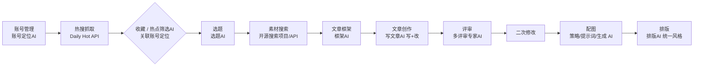

# 自媒体内容创作平台 · 产品方案评审

> 产品通视角：先把你的流程吃透，再查漏补缺、把模糊点定义清楚。核心结论——你做的不是一个"AI 写稿工具"，而是一条**账号定位驱动、每环节可人工干预的内容生产流水线**。

---

## 一、我理解的你的方案（对齐确认）

本质：**「账号定位驱动的内容生产流水线」** + **「人机协同（HITL）」** + **「可回溯修改」**。

整体流程（8 个阶段 + 11 个 AI 角色）：



**各环节与你定义的修改权限：**

| 阶段 | 核心产物 | 可修改 | 不可修改 |
|------|---------|:---:|:---:|
| 1 账号管理 | 账号卡片（定位信息） | ✅ | |
| 2 热搜 | 热搜榜 / 收藏热点 | | ✅（源数据只读，收藏即锁定） |
| 3 选题 | 选题（角度/方向） | ✅ | |
| 4 素材搜索 | 搜索到的资源素材 / 用户上传 | ✅（可多次抓取/上传，累加进集合，无冻结） | |
| 5 文章框架 | 框架（标题/论点/收尾） | ✅ | |
| 6 文章创作 | 成稿（写+改） | ✅ | |
| 7 评审 | 评审意见 + 修改后稿 | ✅（一轮即终） | |
| 8 配图 / 排版 | 配图 + 最终排版稿 | ✅ | |

---

## 二、核心架构原则（建议从 Day 1 固化）

8 个阶段跑起来很容易乱，建议引入两个底层机制作为地基：

1. **状态机（已放宽）**：每个产物（artifact）有 `草稿 → 已锁定` 状态。**`锁定` 代表"定稿基线"，但不再是下游消费的硬门槛**——下游可通过"关联"消费草稿态产物，用户知情即可。例如：框架可关联一个仍为草稿的选题继续往下走。
2. **版本历史**：每个可修改环节至少保留上一版，尤其是"评审后二次修改"——没有版本对比，人工根本看不出 AI 改了什么、为什么改。

> 这两点是地基，不是功能。建议在数据模型设计阶段就埋进去，否则后面每加一个环节都要返工。

---

## 三、关键模糊点：我来帮你定义

### 3.1 选题（Topic）到底是什么？—— 你卡住的点

你的直觉是对的：**选题 ≠ 框架**，但你现在的描述把两者边界说混了。我建议这样切：

- **选题（决策层）**：回答"写什么 + 写给谁 + 什么角度 + 核心观点"。它是从「热点 + 账号定位」里长出来的**判断**。
- **框架（结构层）**：回答"文章怎么搭"。是选题定下来之后的**骨架**（标题/论点一/论点二/收尾）。

**选题 AI 输入（固定两要素）**：`账号信息（<账号定位> XML，可选）` + `热搜关键词`（来自收藏热点自动带入，或手动输入）。**两种入口收敛为同一输入**：
- **A. 从收藏热点** → 自动带入热搜关键词（relatedHotIds 软引用）
- **B. 手动输入关键词/主题** → 用户自打（relatedHotIds 可空）

**选题 AI 输出（JSON 列表，由 schema 决定，随 schema 变而变）**：输出结构不写死，由「全局字段 schema」决定——schema 的字段名即 JSON 的键。schema 改，输出随之改（固定机制）。

**默认字段 schema（7 字段，可配置，修改即生效为新默认）**：

| 字段 | 说明 | 必填 |
|------|------|------|
| 选题主题 | 一句话主题 | 必填 |
| 切入角度 | 差异化视角 | 必填 |
| 目标读者 | 账号受众里的哪一类 | 必填 |
| 核心观点 | 文章要立住的 thesis | 必填 |
| 情绪基调 | 理性 / 共情 / 犀利 / 争议… | 必填 |
| 拟标题方向 | 1–3 个候选（MVP 纯文本多行） | 必填 |
| 备注 | 人工补充 | 可选 |

> 用户可在设置增删改字段名；**修改后该 schema 即成为新的全局默认（持久化）**，后续生成一律按最新 schema 出 JSON。全局一套（不做每账号覆盖）。关联性质：`accountIds` / `relatedHotIds` 均为**可选软引用**，可空——选题可完全独立存在，流程可从任意环节启动，靠"关联字段"松串接。收藏进"选题库"，不打标签平铺。详见 `PRD-选题AI.md` v0.3。

这样选题就有了"实体"，且保持松耦合。

### 3.2 账号定位字段（一切的起点）

账号定位是热搜筛选、选题、文章语气的**总开关**，但它同时也是**所有下游 AI 调用的统一输入格式**——系统内部存字段记录，喂给 LLM 时统一序列化为「**XML 标签包裹纯文本**」，标签名即实体名（如 `<账号定位>…</账号定位>`）。**外层 XML 全链路统一**；内层为纯文本「字段名：值」（不用 JSON，已决策）。各模块内层结构各自约定，本次只定账号定位的。

**默认字段（8 个，全纯文本，可增删改）**：账号名称、简介、领域、目标受众、写作风格、IP 人设、差异化定位、价值主张。用户可添加任意自定义字段（一等公民，同样进纯文本）。

**已砍掉**：雷区/禁止事项、参考标杆（AI 不知如何参考）、Embedding 向量化、预制模板。

**账号↔热点匹配（无 Embedding）**：热点筛选 AI 把本账号的 `<账号定位>` XML 纯文本作为上下文拼入 prompt，由 LLM 直接判断契合度——不做向量检索。

### 3.3 搜索要不要 AI？—— 我的判断：要，但只在两层薄薄地用

- 搜索引擎本身**不是 AI**（走开源搜索项目/API，机械执行爬取/检索）。
- AI 在这两个地方值得用：
  1. **查询拆解（query decomposition）**：把"热搜词"拆成多维度检索词。例：「AI 监管新规」→ 政策原文 / 专家解读 / 行业影响 / 真实案例 / 反面观点。
  2. **（v0.2 移除）**：原计划的"结果压缩/素材浓缩 AI"已移除——用户决策素材保留全文原文、不浓缩，故搜索执行保持机械，AI 只薄用在查询拆解。
- **结论**：仅加一层轻量 AI（query 拆解），搜索执行保持机械。**不要为了用 AI 而用 AI**——搜索的"全"靠机械层，AI 只负责"拆得准"。

### 3.4 配图 vs 排版 顺序

你最后纠正"配图在排版前"——我支持，并细化成：

```
文章成型 → 配图策略(从文章提取配图点) → 配图提示词 → 配图生成
        → 排版(文字 + 图片 按统一风格最终组装)
```

理由：**排版是"最终组装"环节，理应最后**；配图产出的图片资产要进排版。但要区分两件事——**「统一风格模板」可以很早（甚至随账号）就定义好，「排版执行/套用」在最后**。别把"模板定义"和"排版执行"混为一谈。

---

## 四、11 个 AI 角色盘点（含增删建议）

| # | AI 角色 | 输入 | 输出 | 优先级 |
|---|--------|------|------|:---:|
| 1 | 账号定位 AI | 用户给的零散信息/问答 | 完整账号定位字段 | **模块一（首做）** |
| 2 | 热点筛选 AI | 热搜榜 + 账号定位 | 适配该账号的热点子集 | P0 |
| 3 | 选题 AI | 收藏热点 + 账号定位 | 选题（角度/核心观点/拟标题） | **模块三** |
| 4 | 搜索拆解 AI（薄） | 热搜词 | 多维度检索词 | P1（已封板，见模块六） |
| 6 | 框架 AI | 选题 + 账号(含IP) + 素材(可选,P1接入) + 模板 | <框架> XML: 标题/开头/论点×N/结尾（模板驱动,提纲式） | P0 |
| 7 | 写文章 AI | 框架(泛型解析) + 账号 + 素材(可选,P1) | 成稿（写 + 改；改稿含用户指令/评审意见） | P0 |
| 8 | 评审 AI（多角色，一轮） | 成稿 + 可选(账号/框架/素材) + 维度 | 多份 `<评审意见>`（对齐写文章 §4.3） | **模块八（已封板）** |
| 9 | 配图策略 AI | 文章 + 可选账号定位 | `<配图策略>`(配图点列表) | **模块九（已封板）** |
| 10 | 配图提示词 AI | 配图点 + 配图风格 + 可选账号定位 | `<配图提示词列表>` | **模块十（已封板）** |
| 11 | 配图生成 AI | 配图提示词 | 图片资产(本地,调 generateImage) | **模块十一（已封板）** |
| 12 | 排版 AI | 文字 + 图片 + 样式模板 | 最终排版稿（md2wechat 渲染） | **模块十二（已封板）** |

**v0.2 已移除"素材浓缩 AI"（原 #5）**：用户决策素材保留全文原文、不浓缩，故该角色删除，框架 AI 直接消费全文素材（见模块六 §5）。

**评审 AI 角色体系（v0.2 修订：无默认，用户自建）：**
- 本模块**不预置任何角色**；用户自己创建角色、写 system prompt、可指定模型与提取规则，独立运行。
- 调用时"选成稿 + 选多角色"并行评审，每份输出严格为 `<评审意见>`（对齐写文章 §4.3）。
- 模型返回先经**可配置提取规则**截出 `<评审意见>` 块（抗 CoT 噪声），再解析；严重度仅 高/中/低（无阻塞级）；应用改稿无预览直接触发 revise。

**构建顺序（按流程顺序 + 依赖排）：**
- **模块一（首做，已封板）**：账号定位 AI —— 流水线源头，最自包含，定义全局 HITL 模式 + XML 包裹纯文本约定。
- **模块二（已封板）**：热点模块 —— DailyHotApi 抓取 + 收藏 + 热点筛选 AI（关联账号定位）。数据源开源、不依赖 AI，先打通"原料"入口。
- **模块三（已封板）**：选题 AI —— 消费收藏热点 + 账号定位 → 选题决策实体（松耦合，JSON 可配置 schema）。
- **模块四（已封板）**：框架 AI —— 消费选题 + 账号定位 + 模板 → 提纲式骨架 `<框架>`（模板驱动默认 标题/开头/论点一/二/三/结尾，可编辑；卡片墙一行 4 个；无素材模式，P0）。
- **模块五（已封板）**：写文章 AI —— 消费 `<框架>`(泛型解析) + `<账号定位>` + `<素材>`(可选) → 完整成稿（Markdown）；**写 + 改双职责**（改稿含用户指令 / 评审意见契约 §4.3，版本管理，所见即所得富文本编辑器，写/改均支持 count 候选，篇幅软约束不传硬字数）。
- **模块六（已封板）**：素材搜索 —— SearXNG 内置 Docker 一键起（方案 A）+ 用户上传（Markdown 输入框）；**不建检索型素材库**（追加式列表，SQLite 行存储，关联靠浏览+筛选）；**全文保留不浓缩**（移除素材浓缩 AI，仅搜索拆解 AI）；**累加语义**（AI 多次抓取/上传均追加，无冻结）；定义 `<素材>` 全文结构契约（补齐写文章 PRD §4.2）。
- **模块八（已封板）**：评审 AI —— 角色库**用户自建（无默认）**、多角色并行 → 多份独立 `<评审意见>`（**严格对齐写文章 §4.3 契约**）；模型返回经**可配置提取规则**截块（抗 CoT）；严重度仅 高/中/低；一轮即终、无应用预览，采纳意见拼 `<修改指令>` 触发写文章 revise；评审任务为成稿关联产物（非耦合）。
- **P0 主线补齐**：框架 → 写文章（写文章已支持可选 `<素材>`；素材搜索模块六已定义 `<素材>` 全文契约，接入即可消费）。
- **模块九~十一（已封板）**：配图三件套 —— 策略 AI（成稿→配图点 `<配图策略>`)→ 提示词 AI（配图点+风格→`<配图提示词列表>`，提示词默认中文、中→英翻译开关默认关）→ 生成 AI（调网关 `generateImage()` 出图，本地资产，候选/换模型重生成）；全部 XML 输出经网关 `extractBlock` 抗 CoT；配图风格默认 1 全局、可多套、不绑定账号、关联使用；封面图单独区分（默认 2.35:1）；未选候选定稿后 30 天自动清理。
- **模块十二（已封板）**：排版 AI —— 消费「成稿 + 配图资产(正文图 + 封面 2.35:1) + 排版模板」→ AI 轻编排（`<排版方案>`：配图落位 + 选/推荐模板 + 封面位 + 可选导读/结尾互动语，**不改写正文**）→ 渲染内核 **md2wechat（npm / MIT）** 产出公众号兼容 HTML + 本地 MD/HTML（一键复制粘贴）；排版模板同配图风格口径（默认 1 全局 / 可多套 / 不绑账号 / 关联使用）；小红书长图留 P2。详见 `PRD-排版AI.md`。
- 理由：能不能产出"能用的初稿"是生死线，先跑通主线证明质量，再堆后面环节。

---

## 五、我发现的缺口 / 风险

1. **模型网关是隐藏地基**：所有 AI 角色都依赖统一 LLM 调用层。已明确需兼容 豆包/智谱/Kimi/Deepseek/Gemini/ChatGPT/Claude + OpenAI 通用协议 + 中转站（New API 类）。必须先建，详见 `PRD-账号定位AI.md` 第 5 节。
2. **素材全文 token 溢出**（v0.2 改为全文保留、不浓缩）：多条全文素材注入写文章可能撑爆上下文。缓解：写文章提示词约束截断、只关联精选子集；SearXNG 返回的 content 本身为摘要级（非网页全文），实际风险可控。已在 `PRD-素材搜索.md` §11 标注。
3. **评审闭环**：已定为**一轮**即改稿结束，流程干净，无需多轮状态机。
4. **合规与版权**：抓取内容版权、AI 配图版权、各平台对"AI 生成内容"的标识要求（公众号/小红书规则）。功能设计默认要标风险。
5. **成本与模型选型**：12+ 个角色 × 每次调用 LLM/图像模型，成本与延迟要算；配图模型待定（本地应用，需考虑离线/在线）。
6. **数据溯源链**：每个 artifact 存什么、怎么链上游（文章 → 框架 → 选题 → 热点 → 账号），要设计清楚，否则"修改"会失联、不可追溯。
7. **本地应用工程现实**：Windows 桌面（Electron/Tauri 类），本地 SQLite + 本地加密 Key 存储，无服务端。模型网关跑在本地进程。

---

## 六、产品价值定位（帮你一句话说清）

差异化不在"AI 写稿"（ChatGPT 就能写），而在：

> **账号定位贯穿始终的一致性** + **热点→选题→素材的可溯源** + **每环节人工可干预** + **多角色评审** + **排版配图一体化** + **本地私有、Key 不出本机**。

对标纯 ChatGPT 写公众号，你的护城河是"流水线 + 人控 + 一致性 + 隐私本地化"——卖的不是单次生成，是**可复用、可控、可迭代的本地内容生产系统**。

---

## 七、已决策事项（用户 2026-07-23 拍板）

1. **分发形态**：最终产品是 **Windows 本地桌面应用**，无云端发布；成品本地导出（MD/HTML/图片），用户自行复制到各平台后台。数据本地存储，API Key 本地安全存储。
2. **MVP 范围**：先做**单环节深度**——已定为 **「账号定位 AI」（模块一）**。理由：它是流水线源头、最自包含、且能定义全局 HITL 模式（生成→改→锁定→下游消费），后续 7 环节复用。模块二定为 **热点模块**（原料入口，不依赖 AI），模块三定为 **选题 AI**（用户原话最不确定的环节）。
3. **模型兼容（LLM + 图像）**：需兼容 国内（豆包/智谱清言/Kimi/Deepseek）+ 国外（Gemini/ChatGPT/Claude）+ OpenAI 通用调用方式 + 第三方中转站（如 New API）。→ 落地为**模型网关（Model Gateway）**前置基础设施（详见 `技术规格-模型网关.md` v0.2）。已拍板：① 以 OpenAI-compatible 为统一范式，**Claude/Gemini 原生直连 + 中转站两条路都做**（均列入 P0）；② **图像模型统一进网关**（新增 `generateImage()` 抽象，覆盖 DALL·E/Imagen/即梦/SD/Midjourney 代理）；③ 超时/重试用建议固定值（60s / 3 次）；④ **不做成本单价表**，仅本地记录 token 用量与延迟供排障。
4. **评审与素材**：评审**只跑一轮**即改稿结束（非多轮）；素材为**冻结型资产**——一次性生成、锁定，**不允许中途重搜/追加**。

---

*下一步*：模型网关最小可用版 → 账号定位 AI 联调（见 `PRD-账号定位AI.md`）→ 攻克选题 AI。

> 配套文档：`产品方案评审-自媒体创作平台.md`（总评审）、`PRD-账号定位AI.md`（模块一规格）、`技术规格-模型网关.md`（前置基础设施规格）、`PRD-热点模块.md`（模块二规格：DailyHotApi 抓取 + 收藏 + 热点筛选 AI）、`PRD-选题AI.md`（模块三规格：收藏热点 + 账号定位 → 选题决策实体）、`PRD-框架AI.md`（模块四规格：模板驱动 `<框架>` 卡片墙）、`PRD-写文章AI.md`（模块五规格：写+改双职责、Markdown、所见即所得）、`PRD-素材搜索.md`（模块六规格：SearXNG 内置 Docker 抓取 + 用户上传 Markdown + 不建检索库 + 全文保留 + 累加语义 + 定义 `<素材>` 全文契约）、`PRD-评审AI.md`（模块八规格：角色库用户自建无默认、多角色并行评审、可配置提取规则截 `<评审意见>`、对齐 §4.3 契约、每角色独立模型、一轮即终无预览、采纳触发改稿）、`PRD-配图三件套.md`（模块九~十一规格：策略 AI→提示词 AI→生成 AI，走网关 `generateImage()`，XML 输出统一经 `extractBlock` 抗 CoT，配图风格可配置）。
> - `PRD-排版AI.md`（模块十二规格：md2wechat 渲染内核 + AI 轻编排 `<排版方案>`，排版模板可配置，公众号 HTML 一键复制 + 本地 MD/HTML，小红书长图留 P2）。

---

## 八、需求侧闭环状态（2026-07-27 更新）

**模块一~十二全部封板**，自媒体内容生产流水线（账号定位 → 热点 → 选题 → 框架 → 写文章 → 素材 → 评审 → 配图 → 排版）的**需求侧已完全闭环**。

贯穿全模块的架构原则已固化：
- **XML 包裹纯文本**全链路统一约定（标签名 = 实体名），下游拼接 prompt 一致；
- **网关 `extractBlock`** 抗 CoT 公共能力（v0.2 泛化），所有 AI 文本输出统一截取；
- **松耦合关联串接**，可从任意环节启动，靠 `accountIds/relatedHotIds/topicId/frameworkId` 等软引用溯源；
- **HITL 草稿→锁定 + 版本历史**全局机制（锁定非下游硬门槛）；
- **可配置定义层**：账号字段 schema / 选题 schema / 框架模板 / 配图风格 / 排版模板，均本地存储、用户可增删改；
- **开源优先**：热点 DailyHotApi、素材 SearXNG、渲染 md2wechat，均本地进程内运行、无云端依赖；
- **隐私本地化**：数据本地存、API Key 不出本机（DPAPI 加密）。

下一步转入**工程实现**：模型网关 MVP → 模块一联调 → 按流程顺序逐模块落地；渲染内核 md2wechat 建议先行集成验证（确认主题 + 自定义 CSS 覆盖接口形态，见 `PRD-排版AI.md` §9 实现核对项）。
