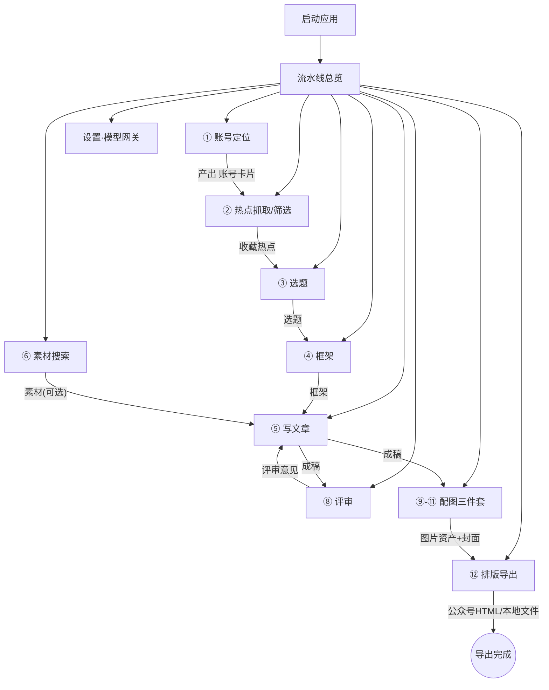

# 页面说明书 · 自媒体内容创作平台（墨流）

> 文档用途：供 UI 设计师**直接据此绘制 UI 设计稿**。每个页面含「入口来源 / 页面目标 / 页面元素 / 页面状态 / 交互规则 / 异常空态 / 跳转规则」七要素，多状态页面附完整状态表。
> 依据文档：`产品方案评审-自媒体创作平台.md`（总评审）+ 模块一~十二 PRD + `技术规格-模型网关.md` + `视觉设计方案.md`（视觉令牌/布局范式）。
> 端：Windows 本地桌面应用（单端，Electron/Tauri 类）。无登录、无云端、单用户。
> 全局复杂度判定：**C 类（复杂需求）**——AI 生成、异步任务、历史版本、多模块联动。

---

## 一、需求说明

本需求用于构建一条「账号定位驱动的自媒体内容生产流水线」，用户可通过侧边栏导航进入任意模块，完成「账号定位 → 热点筛选 → 选题 → 框架 → 写文章 → 素材补充 → 评审 → 配图 → 排版导出」的完整操作，最终产出可直接粘贴到公众号等平台的成品图文；每个 AI 环节产物均可人工修改、锁定、回滚，数据全部存于本机。

---

## 二、主业务流程

### 2.1 全链路主流程（含分支判断）



### 2.2 核心业务循环（含关键判断，UI 必画分支）

```text
入口(任意模块可启动，松耦合)
  → 选产物来源：关联上游产物 / 手动输入（二选一，关联字段可空）
  → 点击「AI 生成」
        ↓
   模型网关可用？
   ├─ 否 → 顶部常驻告警条「网关未配置」→ 跳设置页 → 返回后可重试
   └─ 是 → 生成中（Loading，可离开页面，任务后台继续）
        ↓
   生成成功？
   ├─ 否 → 失败态：错误原因 + 「重试」按钮（超时60s自动重试3次后仍失败才展示）
   └─ 是 → 草稿态产物（可编辑）
        ↓
   人工修改？ ── 是 → 保存为新草稿（版本+1）
        └─ 否
        ↓
   「锁定」→ 锁定态（定稿基线；非下游硬门槛，下游仍可消费草稿）
        ↓
   下游环节：写文章后进入评审循环：
        评审意见 → 采纳/忽略 → 采纳项拼「修改指令」→ 改稿(revise) → 新成稿版本
        （一轮即终，无多轮循环）
        ↓
   配图（可选，可跳过）→ 排版 → 导出/复制 → 结束
```

### 2.3 页面清单总览（28 页）

| # | 页面 | 所属模块 | 类型 |
|---|------|---------|------|
| 0.1 | 应用主框架 | 全局 | 框架 |
| 0.2 | 流水线总览页 | 全局 | 总览 |
| 1.1 | 账号列表页 | 模块一 | 列表 |
| 1.2 | 账号定位向导页 | 模块一 | 向导+AI |
| 1.3 | 账号详情/编辑页 | 模块一 | 表单 |
| 2.1 | 热榜总览页 | 模块二 | 列表 |
| 2.2 | 收藏热点页 | 模块二 | 列表 |
| 2.3 | 热点AI筛选结果页 | 模块二 | 结果 |
| 3.1 | 选题生成页 | 模块三 | 表单+AI |
| 3.2 | 选题卡片墙页 | 模块三 | 卡片墙 |
| 3.3 | 选题库页 | 模块三 | 列表 |
| 4.1 | 框架生成页 | 模块四 | 表单+AI |
| 4.2 | 框架卡片墙页 | 模块四 | 卡片墙 |
| 4.3 | 框架编辑页 | 模块四 | 表单 |
| 4.4 | 框架模板管理页 | 模块四 | 配置 |
| 5.1 | 成稿列表页 | 模块五 | 列表 |
| 5.2 | 写文章工作台 | 模块五 | 工作台 |
| 5.3 | 改稿面板 | 模块五 | 面板 |
| 5.4 | 版本历史面板 | 模块五 | 面板 |
| 6.1 | 素材列表页 | 模块六 | 列表 |
| 6.2 | 素材搜索页 | 模块六 | 表单+AI |
| 6.3 | 素材上传页 | 模块六 | 表单 |
| 8.1 | 评审工作台 | 模块八 | 工作台 |
| 8.2 | 评审意见列表 | 模块八 | 列表 |
| 8.3 | 评审角色管理页 | 模块八 | 配置 |
| 9.1 | 配图策略工作台 | 模块九 | 工作台 |
| 10.1 | 配图提示词工作台 | 模块十 | 工作台 |
| 11.1 | 配图生成工作台 | 模块十一 | 工作台 |
| 12.1 | 排版工作台 | 模块十二 | 工作台 |
| 12.2 | 排版模板管理页 | 模块十二 | 配置 |
| 13.1 | 模型网关设置页 | 设置 | 配置 |
| 13.2 | 全局定义层配置页 | 设置 | 配置 |

---

## 三、全局规则

以下规则影响多个页面，各页面说明中不再重复，仅标注「遵循全局规则」。

1. **导航与入口**：左侧边栏固定 11 个导航项（总览/账号定位/热点/选题/框架/写文章/素材/评审/配图/排版/设置），任何页面可一键切换，不丢当前模块未保存内容（切换前自动存草稿）。
2. **产物状态机（全模块统一）**：每个 AI 产物仅有 `草稿 → 已锁定` 两态。锁定 = 定稿基线，**不是下游消费的硬门槛**——下游可关联并消费草稿态产物，界面需用徽标明示状态。
3. **版本历史（全模块统一）**：每次 AI 生成/改稿/手动保存产生一个版本，可回滚、可对比；手动编辑不丢失。版本列表按时间倒序。
4. **AI 输出契约**：所有 AI 文本输出为「XML 标签包裹纯文本」（标签名=实体名，如 `<框架>…</框架>`），统一经网关 `extractBlock` 截取；解析失败时展示原文并提示人工核对，**不静默丢弃**。
5. **松耦合关联**：产物间靠软引用串接（账号/热点/选题/框架/成稿 ID），关联均可为空；任何模块可从中间环节独立启动（如跳过热点直接手动建选题）。上游产物被删除时，下游产物保留、仅关联标记为「已失效」。
6. **AI 生成任务规则**：生成均为异步任务，用户可离开页面，任务后台继续；超时 60s、自动重试 3 次；多产物批量生成时逐个独立调用，单个失败不影响其余（失败项标红可单独重试）。
7. **模型网关前置**：一切 AI 操作前检查网关是否有可用 Provider。无可用 Provider 时：顶栏出现常驻告警条 + 各「AI 生成」按钮置灰并附提示「请先在设置中配置模型」。
8. **本地隐私**：全部数据存本地（SQLite + 本地文件），API Key 经 DPAPI 加密仅存本机；应用内不出现任何"上传云端/同步"入口。
9. **可配置定义层（全局一套，改即生效）**：账号字段 schema、选题字段 schema、框架模板、配图风格、排版模板均为用户可增删改的本地配置；修改后立即成为新默认，后续生成一律按最新配置。
10. **删除规则（全模块统一）**：删除产物需二次确认；被下游引用的产物删除前提示「已被 N 个下游产物引用，删除后引用失效」；删除不可恢复（不进回收站）。
11. **编辑与锁定互斥**：锁定态产物内容只读，需先「解锁」（回到草稿）才能编辑；解锁不产生新版本。
12. **空态统一**：所有列表/卡片墙空态 = 插画占位 + 一句引导文案 + 主操作按钮（如「立即创建」）。

---

## 四、应用框架与总览

### 4.1 应用主框架（侧边栏 + 顶栏）

#### 1. 入口来源
- 应用启动即加载，所有页面共享此框架。

#### 2. 页面目标
- 提供全局导航、当前上下文（当前账号）、系统状态（网关/主题）的统一承载。

#### 3. 页面元素
- **侧边栏**（固定 232px）：品牌区（Logo「墨流」+ 副标题）、导航组「流水线」（总览/账号定位/热点/选题/框架/写文章/素材/评审/配图/排版，各带模块序号徽标）、导航组「系统」（设置·模型网关）、底部模型状态胶囊（连接状态点 + 「模型网关已连接 · N 提供商」）。
- **顶栏**（固定 56px）：当前页面标题 + 面包屑副标题、亮/暗主题切换胶囊、当前账号芯片（头像 + 账号名，点击弹账号切换浮层）、「＋新建」按钮（按当前模块弹出对应新建入口）。

#### 4. 页面状态
| 状态 | 展示内容 | 按钮状态 | 点击结果 |
|---|---|---|---|
| 网关已连接 | 状态胶囊绿点 + 提供商数 | 全部 AI 按钮可用 | — |
| 网关未配置/全部失败 | 胶囊灰点「未配置」+ 顶栏下常驻告警条「模型网关未配置，AI 功能不可用」 | 全站 AI 生成按钮置灰 | 点告警条「去配置」→ 13.1 设置页 |
| 未选当前账号 | 账号芯片显示「未选账号」 | 可点击 | 弹账号切换浮层（空态时引导去创建） |
| 主题切换 | 亮/暗胶囊当前态高亮 | 可点击 | 即时切换全站主题，选择持久化 |

#### 5. 交互规则
- 点击导航项：切换主内容区视图，当前项高亮；未保存内容自动存草稿后切换。
- 点击账号芯片：弹出账号列表浮层（含「管理账号」入口 → 1.1）。
- 点击「＋新建」：按当前所在模块弹出新建菜单（如热点模块下为「刷新热榜/手动收藏」，选题模块下为「从热点新建/手动新建」）。

#### 6. 异常/空态
- 无账号时账号芯片：「未选账号」，浮层内为空态「暂无账号，去创建」→ 跳 1.2 向导。
- 网关探测失败：告警条常显，不自动消失；重连成功后自动收起。

#### 7. 跳转规则
- 品牌 Logo 点击 → 0.2 总览；「管理账号」→ 1.1；告警条「去配置」→ 13.1。

---

### 4.2 流水线总览页

#### 1. 入口来源
- 应用启动默认页；侧边栏「流水线总览」。

#### 2. 页面目标
- 一眼看清 9 个阶段的定位与当前进度，并作为进入各模块工作台的总入口。

#### 3. 页面元素
- KPI 条（4 卡）：已配置账号数 / 本周进行中流水线数 / 模块建设状态 / 本周产出字数均值。
- 阶段卡片区（3×3 网格，9 卡）：每卡 = 图标 + 模块名 + 模块序号·封板状态 + 一句话职责 + 状态徽标（已完成/进行中/未开始）+ 左侧状态色条。
- 当前账号卡：账号头像 + 名称 + 账号定位关键字段摘要（领域/风格/人设/差异化）。
- 最近动态流：时间 + 事件描述（如「写文章 · 成稿 v3 已锁定」），按时间倒序。

#### 4. 页面状态
| 状态 | 展示内容 | 按钮状态 | 点击结果 |
|---|---|---|---|
| 常规（有数据） | KPI + 9 卡 + 账号卡 + 动态流 | 卡片可点击 | 进入对应模块页 |
| 首次使用（无任何数据） | KPI 全 0；阶段卡全「未开始」；动态流空态「还没有动态，从账号定位开始吧」；账号卡位显示引导卡 | 仅①账号定位卡高亮脉冲引导 | 点① → 1.2 向导 |
| 无当前账号 | 账号卡位显示「未选账号」占位 | 可点击 | 弹账号切换浮层 |
| 动态加载失败 | 动态流区域「加载失败」+ 重试按钮 | 重试可点 | 重新拉取本地记录 |

#### 5. 交互规则
- 点击阶段卡：跳对应模块主页（1.1 / 2.1 / 3.2 / 4.2 / 5.1 / 6.1 / 8.1 / 9.1 / 12.1）。
- 点击动态条目：跳对应产物所在工作台并定位该产物。
- KPI 卡仅展示，不可点击。

#### 6. 异常/空态
- 空数据：各区块按上表空态展示，不报错。
- 本地数据库读取失败：页面级错误态「本地数据读取失败」+「重试」+「打开数据目录」。

#### 7. 跳转规则
- 阶段卡 → 各模块主页；动态条目 → 对应工作台；账号卡 → 1.3 详情。

---

## 五、模块一 · 账号定位

### 5.1 账号列表页

#### 1. 入口来源
- 侧边栏「账号定位」；总览页账号卡；顶栏账号芯片浮层「管理账号」。

#### 2. 页面目标
- 管理全部账号卡片，选择"当前账号"，进入创建/编辑。

#### 3. 页面元素
- 顶部操作区：「＋新建账号」主按钮、搜索框（按账号名称模糊）。
- 账号卡片网格（一行 3 卡）：账号名称、简介、领域、状态徽标（草稿/已锁定）、「当前账号」标记、更新时间与版本数。
- 卡片操作：设为当前 / 编辑 / 复制 / 删除。

#### 4. 页面状态
| 状态 | 展示内容 | 按钮状态 | 点击结果 |
|---|---|---|---|
| 空态 | 插画 +「还没有账号，账号定位是全流程的起点」+「＋新建账号」 | 可点击 | → 5.2 向导 |
| 列表态 | 卡片网格，当前账号卡右上角有「当前」标记 | 全部可用 | 按操作区规则 |
| 搜索无结果 | 「未找到匹配账号」+ 清空搜索 | 清空可点 | 恢复全量列表 |
| 加载失败 | 错误占位 + 重试 | 重试可点 | 重新读取本地库 |

#### 5. 交互规则
- 点击卡片主体：→ 5.3 详情/编辑页。
- 点击「设为当前」：该账号成为全局当前账号（顶栏芯片即时更新），原当前账号标记移除。
- 点击「复制」：生成副本（名称加"副本"后缀，草稿态）。
- 点击「删除」：弹二次确认，若被下游引用显示引用数；确认后删除并提示引用失效。

#### 6. 异常/空态
- 空数据/搜索无结果/加载失败：见状态表。

#### 7. 跳转规则
- 「＋新建账号」→ 5.2；卡片 → 5.3；返回 → 0.2 总览。

---

### 5.2 账号定位向导页

#### 1. 入口来源
- 5.1「＋新建账号」；总览首次引导；账号芯片浮层「去创建」。

#### 2. 页面目标
- 通过 7 个固定引导问题收集素材，调 AI 生成结构化账号定位（8 默认字段），人工确认后保存。

#### 3. 页面元素
- 左：向导步骤条（7 问 + 生成结果 = 8 步，当前步高亮）。
- 中：当前问题的提问文案 + 多行输入框 + 「上一问 / 下一问」+「跳过」。
- 生成阶段：模型选择下拉（默认全局默认模型）+「✨ 生成账号定位」按钮。
- 结果区：AI 生成的 8 字段表单（账号名称/简介/领域/目标受众/写作风格/IP人设/差异化定位/价值主张），每项可编辑，可「＋添加自定义字段」。
- 底部：「↻ 换模型重新生成」「保存为草稿」「保存并锁定」。

#### 4. 页面状态
| 状态 | 展示内容 | 按钮状态 | 点击结果 |
|---|---|---|---|
| 问答中（第 1-7 问） | 步骤条 + 当前问 + 输入框；已答问步骤条打勾 | 上一问（第1问置灰）/下一问/跳过 | 前进/后退/跳问 |
| 待生成（7问完成） | 已答摘要 + 生成区 | 生成可点（网关异常时置灰） | 触发 AI 生成 |
| 生成中 | 结果区骨架屏 +「AI 正在生成…」 | 全部禁用，可离开页面 | 完成后自动进结果态 |
| 生成成功（草稿） | 8 字段表单可编辑 | 编辑/换模型重生成/保存 | 按交互规则 |
| 生成失败 | 错误原因 +「重试」 | 重试可点 | 重新调用 |
| 提取失败（extractBlock 未匹配） | 展示 AI 原文 + 黄条提示「未能解析为字段，请人工核对」| 可手动复制进字段后保存 | 保存 |

#### 5. 交互规则
- 「下一问」：保存当前回答；空回答允许（提示可跳过）。
- 「生成账号定位」：把 7 问回答拼入提示词调网关（`extractBlock{tag:"账号定位"}`）。
- 「换模型重新生成」：用当前所选模型重跑，生成新版本，不覆盖已编辑内容前先弹确认。
- 「保存为草稿 / 保存并锁定」：落库并跳 5.3。
- 「＋添加自定义字段」：新增一行「字段名 + 值」空表单。

#### 6. 异常/空态
- 网关未配置：生成按钮置灰 + 告警条。
- 生成失败/超时：失败态 + 重试（遵循全局规则 6）。
- 中途退出：已答内容自动暂存，再次进入向导提示「继续上次？」。

#### 7. 跳转规则
- 保存成功 → 5.3 详情；左上「×」退出 → 5.1（自动暂存）。

---

### 5.3 账号详情/编辑页

#### 1. 入口来源
- 5.1 卡片；向导保存后；总览账号卡。

#### 2. 页面目标
- 查看与编辑单个账号定位的全部字段，管理版本与锁定状态，作为下游模块的关联来源。

#### 3. 页面元素
- 头部：账号名称（可改）、状态徽标、版本下拉、「设为当前」「锁定/解锁」「删除」。
- 字段表单区：8 默认字段 + 自定义字段，全部多行文本；每字段可改名/删除；「＋添加字段」。
- 右侧栏：关联产物统计（被 N 个选题/成稿…引用）、版本历史列表、字段 schema 提示「改字段结构将影响后续生成」。

#### 4. 页面状态
| 状态 | 展示内容 | 按钮状态 | 点击结果 |
|---|---|---|---|
| 草稿态 | 表单可编辑 | 保存/锁定/删除 可用 | 保存→版本+1 |
| 锁定态 | 表单只读 + 锁定徽标 | 解锁/设为当前/复制 | 解锁→回草稿 |
| 有未保存修改 | 标题旁「未保存」点 | 保存高亮 | 保存后消失 |
| 版本回滚预览 | 选中历史版本只读展示 | 「恢复此版本」可点 | 恢复为新草稿版本 |

#### 5. 交互规则
- 编辑字段：本地即时校验非空（账号名称必填），失焦自动暂存。
- 「保存」：生成新版本；「锁定」：状态翻转为已锁定。
- 「删除」：二次确认 + 引用提示（全局规则 10）。

#### 6. 异常/空态
- 账号被删除后从深链进入：「该账号已删除」+ 返回列表。
- 保存失败（磁盘写入异常）：Toast 报错 + 内容保留在表单。

#### 7. 跳转规则
- 返回 → 5.1；「被引用的下游产物」链接 → 对应工作台。

---

## 六、模块二 · 热点抓取/筛选

### 6.1 热榜总览页

#### 1. 入口来源
- 侧边栏「热点抓取」；总览阶段卡②。

#### 2. 页面目标
- 全量展示 DailyHotApi 聚合的 40+ 平台热榜，支持收藏热点进收藏库。

#### 3. 页面元素
- 顶部：「↻ 刷新全部」按钮、上次刷新时间、DailyHotApi 服务状态点（运行中/未启动）。
- 栏目区：40+ 平台各为一个栏目（标题=平台名 + 条目数 + 单栏刷新），栏目**一行 4 个卡片纵向滚动**，栏目顺序可拖拽调整（顺序持久化）。
- 条目卡：排名、热搜词、热度值、「☆ 收藏」按钮（已收藏变「★ 已收藏」）。

#### 4. 页面状态
| 状态 | 展示内容 | 按钮状态 | 点击结果 |
|---|---|---|---|
| 正常 | 全量栏目 + 条目 | 刷新/收藏 可用 | 按规则 |
| 加载中（首次/刷新） | 栏目骨架屏，逐栏就绪逐栏渲染 | 刷新禁用 | — |
| 单栏加载失败 | 该栏目内「加载失败」+ 单栏重试，其余栏目正常 | 单栏重试可点 | 重拉该源 |
| DailyHotApi 未启动 | 页面级空态「热榜服务未启动」+「一键启动服务」+ 手动刷新指引 | 启动可点 | 启动 Docker 容器并轮询就绪 |
| 服务启动中 | 空态 + 进度「正在启动热榜服务…」 | 禁用 | 就绪后自动加载 |

#### 5. 交互规则
- 点击「↻ 刷新全部」：逐栏并发拉取，逐栏渲染（不整页等待）。
- 点击条目「☆ 收藏」：进收藏库（默认标签「待选题」），按钮变「★」；再点取消收藏。
- 拖拽栏目头：调整栏目顺序，松手即持久化。
- 条目点击：无跳转（热搜词为只读数据，遵循"源数据不可改"）。

#### 6. 异常/空态
- 全部失败：页面级「热榜全部加载失败」+「重试」+ 服务状态检查入口。
- 某平台源被 DailyHotApi 下线：该栏目标记「源不可用」置灰。

#### 7. 跳转规则
- 顶部 Tab/侧栏「收藏热点」→ 6.2；「AI 筛选」→ 6.3。

---

### 6.2 收藏热点页

#### 1. 入口来源
- 6.1 内 Tab「收藏热点」；选题生成页「从收藏热点新建」。

#### 2. 页面目标
- 管理已收藏热点（单列表 + 标签），并作为 AI 筛选与选题的输入来源。

#### 3. 页面元素
- 顶部：标签筛选（全部 / 待选题 / 已用）、「✨ AI 筛选」主按钮、批量操作（批量改标签/批量删除）。
- 收藏列表（单列）：热搜词、来源平台、收藏时间、标签下拉（待选题/已用）、操作（改标签/删除/去选题）。
- 多选框：支持批量选择。

#### 4. 页面状态
| 状态 | 展示内容 | 按钮状态 | 点击结果 |
|---|---|---|---|
| 空态 | 「还没有收藏热点，去热榜收藏几条吧」+「去热榜」 | 可点击 | → 6.1 |
| 列表态 | 全部收藏 | 全部可用 | 按规则 |
| 按标签筛选 | 仅对应标签条目；无匹配时空态 | — | — |
| 有勾选 | 批量操作条浮现（已选 N 条） | 批量改标签/删除可用 | 批量执行 |

#### 5. 交互规则
- 改标签：下拉即改即存（仅两个标签：待选题/已用）。
- 「去选题」：带该热点跳 3.1 选题生成页（自动带入热搜关键词）。
- 「✨ AI 筛选」：→ 6.3（带入当前筛选范围内的收藏）。
- 删除：单条删除即时生效（收藏非产物，无锁定概念，遵循源数据只读原则——收藏记录可删，热点原文不可改）。

#### 6. 异常/空态
- 空数据/筛选无匹配：见状态表。

#### 7. 跳转规则
- 「去热榜」→ 6.1；「去选题」→ 3.1；「AI 筛选」→ 6.3。

---

### 6.3 热点AI筛选结果页

#### 1. 入口来源
- 6.2「✨ AI 筛选」。

#### 2. 页面目标
- 用账号定位对收藏热点做契合度筛选，产出适配该账号的热点子集，可直接去选题。

#### 3. 页面元素
- 配置区：账号选择下拉（必选，默认当前账号）、取前 N 名输入（默认 20）、「开始筛选」按钮。
- 过程区：进度条「正在筛选 X/Y」+ 可取消。
- 结果区（对话式呈现，采纳后不跳转）：每条结果卡 = 热搜词 + 来源平台 + 契合度评分/一句话理由 + 「采纳去选题」「忽略」。
- 顶部摘要：「共筛选 X 条，AI 推荐 Y 条」。

#### 4. 页面状态
| 状态 | 展示内容 | 按钮状态 | 点击结果 |
|---|---|---|---|
| 待开始 | 配置区可编辑 | 开始可点（未选账号置灰；网关异常置灰） | 触发筛选 |
| 筛选中 | 进度 + 取消 | 取消可点 | 中止任务，保留已完成部分 |
| 结果态 | 推荐结果卡列表 | 采纳/忽略 可用 | 采纳→3.1（带热搜词+账号）；忽略→卡片灰化 |
| 全部已处理 | 「已全部处理」摘要 +「重新筛选」 | 可点 | 重置结果态 |
| 筛选失败 | 错误原因 + 重试 | 重试可点 | 重新调用 |
| 无收藏热点 | 空态「先收藏热点再筛选」+ 去热榜 | 可点 | → 6.1 |

#### 5. 交互规则
- 「开始筛选」：把 `<账号定位>` + `<热搜列表>`（取前 N 条）一次喂 AI，经 `extractBlock` 解析推荐子集。
- 「采纳去选题」：该热点标「已用」标签并跳 3.1（本页保留结果，回来自动恢复结果态——采纳不跳转出筛选上下文）。
- 「忽略」：卡片灰化，可撤销。

#### 6. 异常/空态
- AI 返回无法解析：展示原文 + 提示人工核对（全局规则 4）。
- 账号已删除：配置区账号下拉标红「账号已失效」，需重选。

#### 7. 跳转规则
- 采纳 → 3.1；返回 → 6.2。

---

## 七、模块三 · 选题

### 7.1 选题生成页

#### 1. 入口来源
- 6.2/6.3「去选题」；3.2「＋新建选题」（两种入口：从收藏热点 / 手动输入）。

#### 2. 页面目标
- 以「账号信息 + 热搜关键词」为输入，AI 按全局选题 schema 生成候选选题（支持多热点×多账号的 N 次独立调用）。

#### 3. 页面元素
- 入口选择（二选一分区）：A「从收藏热点」= 收藏热点多选列表（仅"待选题"标签）；B「手动输入」= 关键词/主题多行输入。
- 账号选择：多选（默认勾当前账号），与热点做笛卡尔组合生成。
- 生成配置：每组合生成条数（默认 1）、模型选择、「✨ 生成选题」。
- 任务队列区：N 个生成任务逐个展示（组合 = 热点×账号 + 状态点：排队/生成中/成功/失败）。
- 结果预览：成功任务展开显示生成的选题卡（schema 字段渲染）。

#### 4. 页面状态
| 状态 | 展示内容 | 按钮状态 | 点击结果 |
|---|---|---|---|
| 待配置 | 入口区 + 账号区可编辑 | 生成可点（热点与账号均空时置灰） | 创建 N 任务 |
| 生成中 | 任务队列逐条状态流转，可离开页面 | 取消全部可点 | 中止未开始任务 |
| 部分成功 | 成功任务展示结果卡，失败任务标红 + 单条重试 | 重试可点 | 仅重跑失败任务 |
| 全部成功 | 结果卡可「入选题库」「丢弃」 | 可用 | 入库→3.3；丢弃→移除 |
| 全部失败 | 摘要 +「全部重试」 | 可点 | 重跑 |
| 无待选题热点（入口A） | 该分区空态「没有待选题热点，可改用手动输入」 | — | — |

#### 5. 交互规则
- 「✨ 生成选题」：按 热点×账号 笛卡尔积创建独立任务（轮询执行），AI 输出 JSON 列表（字段由全局选题 schema 决定），逐任务解析。
- 「入选题库」：该选题写入选题库（平铺、不打标签），从结果区移除并 Toast 成功。
- 「丢弃」：二次确认后移除该候选。
- 单条重试：仅重跑该组合，新结果覆盖该任务位。

#### 6. 异常/空态
- 网关异常：生成置灰 + 告警条（全局规则 7）。
- JSON 解析失败：该任务标「解析失败」+ 展示原文 + 重试。

#### 7. 跳转规则
- 「入选题库」后可「查看选题库」→ 3.3；返回 → 3.2。

---

### 7.2 选题卡片墙页

#### 1. 入口来源
- 侧边栏「选题」默认落地页；总览阶段卡③。

#### 2. 页面目标
- 以卡片墙纵览最近生成的选题，快速进编辑/框架。

#### 3. 页面元素
- 顶部：「＋新建选题」（下拉：从收藏热点/手动输入）、搜索框。
- 卡片墙：**一排 5 个卡片、纵向滚动、最新置顶**；卡片 = 选题主题（schema 首字段）+ 2~3 个关键字段摘要 + 状态徽标 + 来源标记（热点词/手动）+ 操作（收藏/编辑/删除）。

#### 4. 页面状态
| 状态 | 展示内容 | 按钮状态 | 点击结果 |
|---|---|---|---|
| 空态 | 插画 +「还没有选题，从热点或手动关键词开始」+「＋新建选题」 | 可点 | → 3.1 |
| 卡片墙态 | 5 列网格 | 全部可用 | 按规则 |
| 搜索态 | 按主题模糊过滤；无结果空态 | 清空可点 | 恢复 |

#### 5. 交互规则
- 点卡片：展开详情浮层（全部 schema 字段，可编辑保存 → 3.3 同步）。
- 「收藏」：选题收藏进选题库（3.3），卡片加「已入库」标。
- 「去搭框架」：带该选题 → 4.1。
- 「删除」：二次确认（全局规则 10）。

#### 6. 异常/空态
- 加载失败：错误占位 + 重试。

#### 7. 跳转规则
- 新建 → 3.1；卡片「去搭框架」→ 4.1；「查看选题库」→ 3.3。

---

### 7.3 选题库页

#### 1. 入口来源
- 3.1 入库后「查看选题库」；3.2「查看选题库」。

#### 2. 页面目标
- 长期存放已收藏选题（平铺、无标签），供框架/写文章环节关联选用。

#### 3. 页面元素
- 顶部：搜索框、排序（最新/最早）、「＋手动新建选题」。
- 选题列表（平铺表格/列表）：选题主题、全部 schema 字段摘要、来源（热点词/手动）、入库时间、关联状态（是否已被框架引用）、操作（编辑/去搭框架/移除）。

#### 4. 页面状态
| 状态 | 展示内容 | 按钮状态 | 点击结果 |
|---|---|---|---|
| 空态 | 「选题库为空，生成或手动创建一个选题」 | 新建可点 | → 3.1 |
| 列表态 | 平铺列表 | 全部可用 | 按规则 |
| 已被框架引用 | 关联列显示「已被 N 个框架引用」 | 「去搭框架」变为「再建框架」 | → 4.1 |

#### 5. 交互规则
- 「编辑」：详情浮层改字段，保存新版本。
- 「移除」：二次确认；被引用时提示引用失效（全局规则 5/10）。
- 「去搭框架」：带选题 → 4.1。

#### 6. 异常/空态
- 搜索无结果：空态 + 清空。

#### 7. 跳转规则
- 去搭框架 → 4.1；返回 → 3.2。

---

## 八、模块四 · 框架

### 8.1 框架生成页

#### 1. 入口来源
- 3.2/3.3「去搭框架」；4.2「＋新建框架」（关联选题 / 手动两种入口）。

#### 2. 页面目标
- 按所选框架模板，把选题（+账号定位 +可选素材）扩成提纲式骨架 `<框架>`。

#### 3. 页面元素
- 来源区：选题选择下拉（可空，空=手动主题输入框）+ 账号定位选择（可空）。
- 模板选择：模板下拉（默认模板 + 自定义模板）+「管理模板」链接 → 8.4；模板 section 预览（标题/开头/论点一/二/三/结尾…随模板变）。
- 生成配置：候选数 count（默认 1）、模型选择、「✨ 生成框架」。
- 结果区：count 个候选骨架并排对比，每候选按模板 section 展示「核心句 + 支撑要点」，操作「采用 / 编辑后采用 / 丢弃」。

#### 4. 页面状态
| 状态 | 展示内容 | 按钮状态 | 点击结果 |
|---|---|---|---|
| 待配置 | 来源/模板可编辑 | 生成可点（选题与手动主题均空置灰） | 触发生成 |
| 生成中 | 骨架屏 + 可离开 | 取消可点 | 中止 |
| 成功（草稿） | 候选骨架卡 | 采用/编辑/丢弃/换模型重生成 | 采用→4.3 |
| 失败 | 错误 + 重试 | 可点 | 重跑 |
| 提取失败 | 原文 + 人工核对提示 | 可手动整理后保存 | 保存草稿 |

#### 5. 交互规则
- 「✨ 生成框架」：`<选题>` + `<账号定位>` + `<素材>`(可选) + 模板 section 列表拼 prompt，`extractBlock{tag:"框架"}` 截取；count>1 时多次独立调用。
- 「采用」：存为草稿并跳 4.3；「编辑后采用」：先内联改再采用。
- 「换模型重新生成」：同输入重跑产生新候选。

#### 6. 异常/空态
- 素材为空（无素材模式）：正常生成，不阻塞（P0 无素材模式）。
- 模板被删：模板下拉回退默认模板并提示。

#### 7. 跳转规则
- 采用 → 4.3；管理模板 → 8.4；返回 → 4.2。

---

### 8.2 框架卡片墙页

#### 1. 入口来源
- 侧边栏「框架」默认落地页；总览阶段卡④。

#### 2. 页面目标
- 卡片墙纵览已有框架，进编辑或写文章。

#### 3. 页面元素
- 顶部：「＋新建框架」、搜索框。
- 卡片墙：**一行 4 个卡片、纵向滚动、最新置顶**；卡片 = 框架标题 section 内容 + 模板名 + 论点数摘要 + 状态徽标 + 来源选题 + 操作（编辑/去写文章/删除）。

#### 4. 页面状态
| 状态 | 展示内容 | 按钮状态 | 点击结果 |
|---|---|---|---|
| 空态 | 「还没有框架，选一个选题开始搭建」+「＋新建框架」 | 可点 | → 4.1 |
| 卡片墙态 | 4 列网格 | 全部可用 | 按规则 |
| 搜索态 | 过滤/无结果空态 | 清空可点 | 恢复 |

#### 5. 交互规则
- 点卡片 → 4.3 编辑页。
- 「去写文章」：带框架 → 5.2（写模式）。
- 「删除」：二次确认 + 引用提示。

#### 6. 异常/空态
- 加载失败：错误占位 + 重试。

#### 7. 跳转规则
- 新建 → 4.1；卡片 → 4.3；去写文章 → 5.2。

---

### 8.3 框架编辑页

#### 1. 入口来源
- 4.1 采用后；4.2 卡片点击。

#### 2. 页面目标
- 按模板 section 结构编辑框架内容（核心句 + 支撑要点），管理版本与锁定。

#### 3. 页面元素
- 头部：框架标题、状态徽标、版本下拉、「锁定/解锁」「去写文章」「删除」。
- section 表单区：按模板 section 逐个渲染（每 section = section 名 + 核心句输入 + 支撑要点列表，要点可增删/拖拽排序，每论点 2-4 条要点）。
- 右侧栏：关联选题/账号摘要、版本历史、「✨ 让 AI 重写某 section」（选 section + 指令 → 局部重生成）。

#### 4. 页面状态
| 状态 | 展示内容 | 按钮状态 | 点击结果 |
|---|---|---|---|
| 草稿态 | 全表单可编辑 | 保存/锁定/AI重写 可用 | 保存→版本+1 |
| 锁定态 | 只读 | 解锁/去写文章 | 解锁→草稿 |
| AI 局部重写中 | 目标 section 骨架屏，其余可编辑 | 该 section 禁用 | 完成回填 |
| 有未保存修改 | 「未保存」标记 | 保存高亮 | 保存 |

#### 5. 交互规则
- 要点增删/拖拽：即时生效，保存时落库。
- 「AI 重写某 section」：仅重跑该 section，其余不变，结果先预览再「替换/放弃」。
- 「去写文章」：→ 5.2 写模式（框架须先保存当前修改）。

#### 6. 异常/空态
- 框架被删深链进入：「该框架已删除」+ 返回。
- 模板结构已变更（模板被改）：黄条提示「模板已更新，当前框架按旧结构保存」不影响编辑。

#### 7. 跳转规则
- 去写文章 → 5.2；返回 → 4.2。

---

### 8.4 框架模板管理页

#### 1. 入口来源
- 4.1「管理模板」；13.2 定义层配置入口。

#### 2. 页面目标
- 管理框架模板（默认模板 + 自定义模板）的 section 结构。

#### 3. 页面元素
- 模板列表：模板名、section 数、是否默认、操作（编辑/复制/删除/设为默认）。
- 模板编辑区：section 列表（可增删 section、改名、拖拽排序）+ 模板名 +「保存」。
- 默认模板预置：标题/开头/论点一/论点二/论点三/结尾。

#### 4. 页面状态
| 状态 | 展示内容 | 按钮状态 | 点击结果 |
|---|---|---|---|
| 列表态 | 模板列表 | 全部可用 | 按规则 |
| 编辑中 | section 编辑器 | 保存/取消 | 保存即生效为新结构 |
| 仅剩 1 个模板 | 删除按钮置灰 + 提示「至少保留一个模板」 | 置灰 | — |

#### 5. 交互规则
- 「保存」：模板结构更新；**不影响已生成框架**（其按旧结构存），仅影响后续生成（全局规则 9）。
- 「设为默认」：后续生成页默认选中。
- 「删除」：二次确认；默认模板不可删（需先改默认）。

#### 6. 异常/空态
- section 全部删空：保存时拦截「至少保留 1 个 section」。

#### 7. 跳转规则
- 返回 → 4.1 或 13.2。

---

## 九、模块五 · 写文章

### 9.1 成稿列表页

#### 1. 入口来源
- 侧边栏「写文章」默认落地页；总览阶段卡⑤。

#### 2. 页面目标
- 纵览全部成稿（写/改产物），进入工作台继续创作或送评审/配图/排版。

#### 3. 页面元素
- 顶部：「＋新建成稿」（下拉：从框架新建 / 手动新建）、搜索框、状态筛选（全部/草稿/已锁定）。
- 成稿列表（单列，最新置顶）：标题、字数、状态徽标、当前版本号、关联框架/选题/账号标签、更新时间、操作（打开/去评审/去配图/去排版/删除）。

#### 4. 页面状态
| 状态 | 展示内容 | 按钮状态 | 点击结果 |
|---|---|---|---|
| 空态 | 「还没有成稿，从框架开始写第一篇」+「＋新建成稿」 | 可点 | 弹新建选择 |
| 列表态 | 成稿列表 | 全部可用 | 按规则 |
| 筛选/搜索无结果 | 空态 + 清空 | 可点 | 恢复 |

#### 5. 交互规则
- 「打开」→ 5.2 工作台；「去评审」→ 8.1（自动选中该成稿）；「去配图」→ 9.1 策略工作台；「去排版」→ 12.1。
- 「删除」：二次确认 + 引用提示（评审/配图/排版引用数）。
- 状态筛选与搜索可叠加。

#### 6. 异常/空态
- 加载失败：错误占位 + 重试。

#### 7. 跳转规则
- 打开 → 5.2；各下游入口 → 对应工作台。

---

### 9.2 写文章工作台

#### 1. 入口来源
- 9.1「打开」/「从框架新建」；4.2/4.3「去写文章」。

#### 2. 页面目标
- 三栏工作台完成「写」：基于框架泛型解析逐 section 扩写成 Markdown 成稿，所见即所得编辑。

#### 3. 页面元素
- **左栏（上下文）**：关联框架卡（按模板 section 展示骨架，可折叠）、关联素材卡列表（可增删关联 → 6.1 选择）、账号定位卡、关联关系可后补（下拉改绑）。
- **中栏（编辑器）**：富文本工具栏（B/I/H1/H2/引用/列表/代码/图片/源码切换）、所见即所得编辑区（渲染后富文本）、底部状态条（字数统计/自动保存时间）。
- **右栏（AI 面板）**：「✨ AI 写成稿」按钮（空稿时）、模型选择、候选数 count（1-3）、候选对比区（count>1 时并排「采用」）、「生成改稿」入口 → 5.3、「版本历史」→ 5.4、顶部头部条（标题/状态徽标/锁定按钮）。

#### 4. 页面状态
| 状态 | 展示内容 | 按钮状态 | 点击结果 |
|---|---|---|---|
| 空稿（待写） | 编辑器空态「让 AI 基于框架写初稿，或直接动笔」 | AI 写成稿可点（无框架且无主题置灰） | 触发生成 |
| 生成中 | 编辑器骨架屏 + 「AI 写作中…」，可离开页面 | 取消可点 | 中止 |
| 草稿态 | 富文本可编辑 | 保存/锁定/改稿/版本 可用 | 失焦自动保存草稿 |
| count>1 候选待选 | 候选并排对比，正文区禁用 | 各候选「采用」可点 | 采用→覆盖编辑区为新草稿 |
| 锁定态 | 编辑器只读 + 锁定徽标 | 解锁/送评审/送配图/送排版 | 解锁→草稿 |
| 生成失败 | 编辑器内错误条 + 重试 | 可点 | 重跑 |
| 提取失败 | 原文 + 人工核对提示 | 可手动整理 | 保存草稿 |

#### 5. 交互规则
- 「✨ AI 写成稿」：`<框架>`(泛型解析全部 section) + `<账号定位>`(可选) + `<素材>`(可选全文) → `extractBlock`；篇幅提示词软约束，不传字数参数。
- 编辑器编辑：失焦自动保存（不产生新版本，更新当前草稿）；手动 Ctrl+S / 点保存 → 新版本。
- 「锁定」：状态翻转；锁定后可送评审/配图/排版（草稿也可送，遵循全局规则 2）。
- 源码切换：Markdown 源码 ↔ 富文本双向切换，内容同步。
- 关联变更：左栏改绑框架/素材/账号，即时生效并记录。

#### 6. 异常/空态
- 素材全文过长：注入前截断并在左栏素材卡标「已截断」提示。
- 框架被删：左栏框架卡显示「框架已失效」，不阻塞写作。

#### 7. 跳转规则
- 送评审 → 8.1；送配图 → 9.1；送排版 → 12.1；返回 → 9.1。

---

### 9.3 改稿面板

#### 1. 入口来源
- 5.2 右栏「生成改稿」；8.2 评审「应用评审改稿」（自动带入评审意见）。

#### 2. 页面目标
- 完成「改」：基于用户指令或评审意见对当前成稿做最小必要改动，产出新成稿版本。

#### 3. 页面元素
- 面板（右侧抽屉或中栏弹层）：修改指令多行输入（评审来源时预填采纳意见序列化）、「从框架对齐」开关（带框架时可开）、候选数 count（默认 1）、模型选择、「⚡ 生成改稿」。
- 改稿结果区：count 个候选新版本，支持「与当前稿对比」（差异高亮）、「采用」「放弃」。

#### 4. 页面状态
| 状态 | 展示内容 | 按钮状态 | 点击结果 |
|---|---|---|---|
| 待输入 | 指令框可编辑 | 生成可点（指令空置灰） | 触发 revise |
| 生成中 | 结果区骨架屏 | 取消可点 | 中止 |
| 成功 | 候选新版本 + 对比视图 | 采用/放弃/重生成 | 采用→新版本进 5.2 |
| 失败 | 错误 + 重试 | 可点 | 重跑 |

#### 5. 交互规则
- 「⚡ 生成改稿」：`<原稿>` + `<修改指令>` + 可选 `<框架>` → 输出完整新成稿（非 diff）。
- 「与当前稿对比」：并排差异高亮（新增绿/删除红）。
- 「采用」：生成新版本（旧版本进历史，可回滚）；「放弃」：丢弃候选。
- 从评审进入时指令预填，可再编辑。

#### 6. 异常/空态
- 指令与框架冲突：生成结果顶部黄条提示「指令与框架存在冲突，已按指令修改」。

#### 7. 跳转规则
- 采用后 → 5.2（自动选中新版本）；关闭面板 → 5.2。

---

### 9.4 版本历史面板

#### 1. 入口来源
- 5.2 右栏「版本历史」。

#### 2. 页面目标
- 查看写/改全量版本，对比与回滚。

#### 3. 页面元素
- 版本列表（倒序）：版本号、类型徽标（AI写/AI改/手动/回滚）、时间、字数、摘要（首行）、当前版本标记。
- 选中版本：只读预览 +「与当前版本对比」「恢复此版本」。

#### 4. 页面状态
| 状态 | 展示内容 | 按钮状态 | 点击结果 |
|---|---|---|---|
| 列表态 | 版本列表 | 全部可用 | 按规则 |
| 对比态 | 双栏差异高亮 | 关闭对比 | 回列表 |
| 仅 1 个版本 | 「对比」置灰 | — | — |

#### 5. 交互规则
- 「恢复此版本」：以该版本内容生成新版本（不删历史），编辑器自动载入。
- 锁定态成稿恢复版本：先自动解锁为新草稿。

#### 6. 异常/空态
- 版本读取失败：条目标「内容损坏」不可选。

#### 7. 跳转规则
- 恢复/关闭 → 5.2。

---

## 十、模块六 · 素材搜索

### 10.1 素材列表页

#### 1. 入口来源
- 侧边栏「素材」默认落地页；5.2 左栏「关联素材」选择器。

#### 2. 页面目标
- 浏览/筛选全部素材（搜索抓取 + 上传，追加式累加），管理素材并供写文章关联。

#### 3. 页面元素
- 顶部：「🔍 搜索素材」→ 10.2、「⬆ 上传素材」→ 10.3、搜索框（标题/正文 LIKE 模糊）、来源类型筛选（全部/搜索抓取/用户上传）、时间排序。
- 素材列表（单列，最新置顶）：标题、来源类型徽标、来源 URL、收录时间、正文摘要（前 2 行）、操作（查看全文/删除）。

#### 4. 页面状态
| 状态 | 展示内容 | 按钮状态 | 点击结果 |
|---|---|---|---|
| 空态 | 「素材库为空，搜索或上传第一批素材」+ 双按钮 | 可点 | → 10.2 / 10.3 |
| 列表态 | 素材列表 | 全部可用 | 按规则 |
| 筛选无结果 | 空态 + 清空筛选 | 可点 | 恢复 |
| SearXNG 未启动（仅影响搜索按钮） | 列表正常，「🔍 搜索素材」旁黄点提示 | 列表操作正常 | 点搜索 → 10.2 内处理启动 |

#### 5. 交互规则
- 「查看全文」：浮层展示素材全文（Markdown 渲染）+ 来源 URL 可打开浏览器。
- 「删除」：二次确认；被成稿引用时提示引用失效（素材为累加集合，可删单条，无锁定概念）。
- 关联选择器模式下：条目多选 +「确认关联 N 条」。

#### 6. 异常/空态
- 加载失败：错误占位 + 重试。

#### 7. 跳转规则
- 搜索 → 10.2；上传 → 10.3；返回 → 0.2。

---

### 10.2 素材搜索页

#### 1. 入口来源
- 10.1「🔍 搜索素材」。

#### 2. 页面目标
- 输入关键词，AI 拆解为多维度检索词，调 SearXNG 抓取，结果追加进素材库。

#### 3. 页面元素
- 配置区：关键词输入（必填，支持粘贴热搜词）、「AI 拆解检索词」预览区（生成后展示拆解出的多维度词，可删词）、「开始搜索」。
- 过程区：进度「正在检索 X 个维度…」+ 可取消。
- 结果区：抓取结果卡列表（标题/摘要/来源 URL），逐条「入库」「忽略」，顶部「全部入库」。
- 服务状态条：SearXNG 状态（运行中/未启动 +「一键启动」）。

#### 4. 页面状态
| 状态 | 展示内容 | 按钮状态 | 点击结果 |
|---|---|---|---|
| 待配置（服务正常） | 关键词可输入 | 开始可点（关键词空置灰） | 先 AI 拆解再检索 |
| SearXNG 未启动 | 配置区禁用 + 状态条「未启动」+「一键启动」 | 启动可点 | 启动容器，就绪后解禁 |
| 服务启动中 | 进度提示 | 禁用 | 就绪自动恢复 |
| 拆解中/检索中 | 进度 + 取消 | 取消可点 | 中止（已抓取结果保留） |
| 结果态 | 结果卡列表 | 入库/忽略/全部入库 | 入库→追加进 10.1（累加） |
| 部分入库 | 已入库卡标「已入库」 | 剩余可继续 | — |
| 搜索无结果 | 「未找到相关素材，换个关键词试试」 | 返回重试 | — |
| 失败 | 错误 + 重试 | 可点 | 重跑 |

#### 5. 交互规则
- 「开始搜索」：先调 AI 拆解（query decomposition），展示拆解词供删改确认后并发检索。
- 「入库」：该条全文 + 来源 URL 追加进素材库（不累判重，允许重复入库由用户掌控）。
- 可多次发起搜索，结果均累加（全局"累加语义"）。

#### 6. 异常/空态
- 单维度检索失败：该维度标红，其余维度结果正常展示。
- AI 拆解失败：降级为「直接用原关键词检索」+ 提示。

#### 7. 跳转规则
- 「查看素材库」→ 10.1；返回 → 10.1。

---

### 10.3 素材上传页

#### 1. 入口来源
- 10.1「⬆ 上传素材」。

#### 2. 页面目标
- 通过 Markdown 输入框手工录入/粘贴素材，追加进素材库。

#### 3. 页面元素
- 表单：标题（必填）、来源 URL（选填）、正文 Markdown 多行输入框（必填，支持粘贴长文）、实时预览（右侧渲染）。
- 操作：「保存入库」「清空」。

#### 4. 页面状态
| 状态 | 展示内容 | 按钮状态 | 点击结果 |
|---|---|---|---|
| 编辑中 | 表单可编辑 | 保存可点（必填缺失置灰） | 校验→入库 |
| 保存成功 | Toast「已入库」+ 表单清空 +「继续上传/去素材库」 | 可点 | 按选择 |
| 校验失败 | 必填项红框 + 错误提示 | — | — |

#### 5. 交互规则
- 「保存入库」：校验标题+正文非空 → 追加进素材库（来源类型=用户上传）。
- 防重复提交：保存中按钮 Loading 禁用。

#### 6. 异常/空态
- 保存失败：Toast 报错，表单内容保留。

#### 7. 跳转规则
- 去素材库 → 10.1；返回 → 10.1。

---

## 十一、模块八 · 评审

### 11.1 评审工作台

#### 1. 入口来源
- 侧边栏「评审」默认落地页；5.2/9.1「去评审」。

#### 2. 页面目标
- 选成稿 + 选多角色，并行发起评审，产出多份独立 `<评审意见>`。

#### 3. 页面元素
- 配置区：成稿选择下拉（必选，带来源时自动选中，显示标题+版本+状态）、评审角色多选卡（角色名+模型+维度摘要，支持全选）、「管理角色」→ 8.3、「✨ 开始评审」。
- 任务区：每角色一条评审任务（角色名 + 状态点：排队/评审中/完成/失败 + 单条重试）。
- 结果区：完成的评审按角色分卡折叠展示意见摘要，「查看全部意见」→ 8.2。
- 空角色引导：无角色时配置区显示「还没有评审角色，先创建一个」+「去创建」。

#### 4. 页面状态
| 状态 | 展示内容 | 按钮状态 | 点击结果 |
|---|---|---|---|
| 待配置 | 成稿/角色可选 | 开始可点（成稿或角色未选置灰） | 创建 N 并行任务 |
| 评审中 | 逐角色状态流转，可离开页面 | 取消全部可点 | 中止未完成 |
| 部分完成 | 完成角色出结果卡，失败标红+重试 | 重试/查看意见 | 按规则 |
| 全部完成 | 结果卡 +「查看全部意见」 | 可点 | → 8.2 |
| 无评审角色 | 引导空态 | 去创建可点 | → 8.3 |
| 全部失败 | 摘要 + 全部重试 | 可点 | 重跑 |

#### 5. 交互规则
- 「✨ 开始评审」：每选中角色一次独立并行调用（角色各自 systemPrompt + modelId + extractionRule），经 `extractBlock{tag:"评审意见"}` 解析；一轮即终。
- 单条重试：仅重跑该角色。
- 成稿切换：已选成稿变更时清空当前结果（提示）。

#### 6. 异常/空态
- 角色模型未配置：该角色任务直接失败「模型不可用」，可改模型后重试。
- 提取失败：该角色意见区展示原文 + 人工核对提示。

#### 7. 跳转规则
- 查看意见 → 8.2；管理角色 → 8.3；返回 → 9.1。

---

### 11.2 评审意见列表

#### 1. 入口来源
- 11.1「查看全部意见」。

#### 2. 页面目标
- 汇总多角色评审意见，逐条采纳/忽略，采纳项拼「修改指令」触发改稿（一轮即终）。

#### 3. 页面元素
- 顶部：成稿信息条（标题/版本）+ 汇总计数（高/中/低各 N 条，已采纳 X 条）。
- 意见列表（按角色分组折叠）：每条 = 严重度徽标（高红/中橙/低灰）+ 角色名 + 位置 + 问题 + 建议 + 采纳勾选（默认全采纳）+ 编辑（改建议文案）。
- 底部固定操作条：「已选 N 条 → 应用评审改稿」主按钮、「全部忽略」。
- 人工追加区：「＋追加人工意见」输入行。

#### 4. 页面状态
| 状态 | 展示内容 | 按钮状态 | 点击结果 |
|---|---|---|---|
| 默认 | 全部意见，默认全采纳 | 应用改稿可点（0 条采纳置灰） | 拼指令 → 9.3 |
| 有编辑 | 已编辑意见标「已改」 | 应用改稿可点 | 用改后文案 |
| 应用中 | 按钮 Loading +「正在改稿…」 | 禁用 | 完成跳 5.2 新版本 |
| 应用失败 | Toast 报错 + 意见保留 | 重试可点 | 重新触发 |

#### 5. 交互规则
- 勾选/取消：即时更新底部计数。
- 「应用评审改稿」：采纳项（含人工意见）序列化拼 `<修改指令>` → 调写文章 revise → 跳 5.2 并选中新版本；**无预览直接改稿**。
- 「全部忽略」：清空勾选（可再勾回）。
- 评审流程至此一轮结束，不生成第二轮任务。

#### 6. 异常/空态
- 无意见（AI 全返回无问题）：空态「本轮评审无意见，可直接送配图/排版」+ 快捷入口。

#### 7. 跳转规则
- 应用改稿 → 5.2；返回 → 11.1。

---

### 11.3 评审角色管理页

#### 1. 入口来源
- 11.1「管理角色」；13.2 定义层配置入口。

#### 2. 页面目标
- 自建评审角色库（无默认角色）：定义名称、system prompt、模型、提取规则。

#### 3. 页面元素
- 角色列表：角色名、模型、维度摘要、操作（编辑/复制/删除）。
- 角色编辑表单：角色名（必填）、system prompt（多行必填，给提示性模板）、模型选择（空=全局默认）、提取规则（默认截 `<评审意见>` 块，可改正则）、维度标签（事实/可读性/调性/合规/传播，多选）。
- 「＋新建角色」「导出角色集 JSON」「导入角色集」。

#### 4. 页面状态
| 状态 | 展示内容 | 按钮状态 | 点击结果 |
|---|---|---|---|
| 空态 | 「还没有评审角色，创建第一个角色开始评审」+ 新建 | 可点 | 弹编辑表单 |
| 列表态 | 角色列表 | 全部可用 | 按规则 |
| 编辑中 | 表单 | 保存可点（必填缺失置灰） | 保存入库 |
| 导入冲突 | 同名角色提示「覆盖/保留两者」 | 二选一 | 按选择 |

#### 5. 交互规则
- 「保存」：角色入库，评审工作台立即可选。
- 「删除」：二次确认（不影响历史评审记录）。
- 「导出/导入」：JSON 文件读写，导入校验结构。

#### 6. 异常/空态
- 导入文件格式错误：Toast「文件格式不正确」。

#### 7. 跳转规则
- 返回 → 11.1 或 13.2。

---

## 十二、模块九~十一 · 配图三件套

### 12.1 配图策略工作台（模块九）

#### 1. 入口来源
- 侧边栏「配图」默认落地页；9.1「去配图」；5.2「送配图」。

#### 2. 页面目标
- 从成稿自动提取配图点（位置/类型/场景/尺寸/风格约束），产出 `<配图策略>` 供提示词环节消费。

#### 3. 页面元素
- 配置区：成稿选择下拉（必选，带来源时自动选中）、账号定位选择（可选，风格参考）、模型选择、「✨ 提取配图点」。
- 左：成稿预览（Markdown 渲染，只读）。
- 右：配图点卡片列表，每卡 = 位置锚点 + 类型 + 配图理由（折叠），展开看全字段（场景描述/尺寸建议/风格约束）；卡片操作：编辑/删除/拖拽调序；「＋手动添加配图点」。
- 头部：状态徽标（草稿/已锁定）、「锁定/解锁」「去生成提示词」。

#### 4. 页面状态
| 状态 | 展示内容 | 按钮状态 | 点击结果 |
|---|---|---|---|
| 待配置 | 成稿/账号可选 | 提取可点（未选成稿置灰；网关异常置灰） | 触发提取 |
| 提取中 | 右侧骨架屏，可离开页面 | 取消可点 | 中止 |
| 成功（草稿） | 配图点卡片列表 | 编辑/拖拽/增删/锁定 | 按规则 |
| 无配图点 | 「AI 认为本文无需配图」+ 手动添加入口 | 可点 | 手动加卡 |
| 锁定态 | 卡片只读 | 解锁/去生成提示词 | 解锁→草稿 |
| 失败 | 错误 + 重试 | 可点 | 重跑 |
| 提取失败 | 原文 + 人工核对提示 | 可手动整理 | 保存草稿 |

#### 5. 交互规则
- 「✨ 提取配图点」：`<成稿>` + 可选 `<账号定位>` → `extractBlock{tag:"配图策略"}`；封面类配图点单独标记（默认尺寸建议 2.35:1）。
- 编辑配图点：浮层改全字段（位置/类型/场景描述/尺寸建议/风格约束/配图理由），保存即更新。
- 「去生成提示词」：勾选配图点（可全选）→ 12.2。
- 成稿切换：已有配图点保留并提示「成稿已变更，建议重新提取」。

#### 6. 异常/空态
- 成稿已删除：配置区标红「成稿已失效」，需重选。

#### 7. 跳转规则
- 去生成提示词 → 12.2；返回 → 9.1。

---

### 12.2 配图提示词工作台（模块十）

#### 1. 入口来源
- 12.1「去生成提示词」（带勾选配图点）；侧边栏「配图」内 Tab。

#### 2. 页面目标
- 把每个配图点翻译成图像模型可用的提示词（中文，可选翻译英文），产出 `<配图提示词列表>`。

#### 3. 页面元素
- 配置区：配图风格选择（默认全局风格 + 已存多套，「管理风格」→ 13.2）、中文→英文翻译开关（默认关）、模型选择、「✨ 生成提示词」。
- 提示词编辑卡列表（每个配图点一卡）：关联配图点锚点、提示词多行文本框（可改）、尺寸下拉、风格、数量 count、「单卡重生成」。
- 批量操作：勾选多卡 → 批量生成/批量改尺寸。

#### 4. 页面状态
| 状态 | 展示内容 | 按钮状态 | 点击结果 |
|---|---|---|---|
| 待生成 | 配图点卡 + 空提示词框 | 生成可点（无配图点置灰） | 批量触发生成 |
| 生成中 | 逐卡骨架屏（逐卡独立） | 取消可点 | 中止未完成 |
| 成功（草稿） | 提示词已填，可编辑 | 编辑/单卡重生成/去生成图片 | 按规则 |
| 部分失败 | 失败卡标红 + 单卡重试 | 可点 | 仅重跑该卡 |
| 锁定态 | 只读 | 解锁/去生成图片 | 解锁→草稿 |
| 翻译开关开 | 提示词框旁显示英文译文（可改） | — | 生成图片用英文版 |

#### 5. 交互规则
- 「✨ 生成提示词」：勾选配图点 + `<配图风格>` + 可选 `<账号定位>` → `extractBlock{tag:"配图提示词列表"}`，逐卡回填。
- 提示词手动编辑：即时暂存；尺寸/风格/数量改动影响生成参数。
- 翻译开关（默认关）：开启后对每张卡生成英文提示词副本，生成图片时优先用英文（适配 DALL·E/Imagen）。
- 「去生成图片」：勾选提示词卡 → 12.3。

#### 6. 异常/空态
- 无配图风格：自动生成一个默认全局风格（可后续改）。
- 提取失败：该卡展示原文 + 人工核对提示。

#### 7. 跳转规则
- 去生成图片 → 12.3；返回 → 12.1。

---

### 12.3 配图生成工作台（模块十一）

#### 1. 入口来源
- 12.2「去生成图片」（带勾选提示词）；侧边栏「配图」内 Tab。

#### 2. 页面目标
- 调网关 `generateImage()` 出图，候选选稿，图片资产落本地并关联配图点，供排版消费。

#### 3. 页面元素
- 生成队列区（每张提示词一组）：提示词摘要、模型选择（默认全局图像模型，可逐组改）、尺寸/数量、「生成」按钮、状态点（排队/生成中/完成/失败 + 重试）。
- 候选图网格（每组 count 张）：缩略图 + 「设为定稿」单选 + 放大预览。
- 已定稿资产区：按配图点分组展示定稿图（含封面独立分组，2.35:1）、操作（查看/重生成/插入成稿）。
- 头部：「全部生成」「去排版」。

#### 4. 页面状态
| 状态 | 展示内容 | 按钮状态 | 点击结果 |
|---|---|---|---|
| 待生成 | 生成队列 | 逐组生成/全部生成可点（图像模型未配置置灰） | 触发生成 |
| 生成中 | 网格骨架屏（逐组独立） | 取消可点 | 中止该组 |
| 成功（待定稿） | 候选图网格，未定稿时「去排版」置灰提示 | 设稿/重生成/换模型 | 设稿→资产入库 |
| 已定稿 | 定稿资产区展示 | 查看/重生成/插入成稿/去排版 | 按规则 |
| 部分失败 | 失败组标红 + 重试（含内容拦截原因） | 可点 | 重跑该组 |
| 全部失败 | 摘要 + 全部重试 | 可点 | 重跑 |

#### 5. 交互规则
- 「生成」：调 `gateway.generateImage({model, prompt, size, count, style})`，图片存本地 + DB 记录，关联配图点。
- 「设为定稿」：单选，定稿图进资产区；未选候选保留，**定稿后 30 天自动清理未选候选**（可开关）。
- 「换模型重生成」：改模型重跑，产生新版本候选，不丢已定稿。
- 「插入成稿」（轻操作，默认关）：按配图点位置软锚把 `` 插入成稿 Markdown 副本，可撤销，不动已锁定成稿；封面图不自动插入正文。
- 内容拦截：失败组显示拦截原因 +「修改提示词」快捷跳 12.2。

#### 6. 异常/空态
- 图像模型未配置：生成按钮置灰 + 告警条「请在设置中配置图像模型」。
- 本地磁盘写入失败：错误提示 + 检查存储空间指引。

#### 7. 跳转规则
- 去排版 → 13.1；返回 → 12.2。

---

## 十三、模块十二 · 排版

### 13.1 排版工作台

#### 1. 入口来源
- 侧边栏「排版」默认落地页；9.1/5.2「去排版」；12.3「去排版」。

#### 2. 页面目标
- AI 轻编排（配图落位 + 选模板 + 封面位 + 导读/互动语）→ md2wechat 渲染 → 导出公众号 HTML / 本地文件。

#### 3. 页面元素
- **左栏**：成稿卡（标题/字数/状态）、配图资产缩略图（正文图 + 封面 2.35:1，缺失标「无」）、排版模板选择（默认全局模板 + 多套，「管理模板」→ 13.2）。
- **中栏上（排版方案）**：「✨ 生成排版方案」按钮 + 方案编辑区 = 配图插入点列表（图 → 段落锚点，可拖拽改/可改锚点）、推荐模板（可覆盖）、导读输入框（文首）、结尾互动语输入框（文末）。
- **中栏下（渲染预览）**：「⚡ 渲染预览」+ 白底预览区（md2wechat 套用模板后的成品效果，含封面位）。
- **右栏（导出）**：「📋 复制到公众号」「⬇ 导出 MD」「⬇ 导出 HTML」、排版方案状态徽标 +「锁定/解锁」、版本历史。
- 头部：状态徽标（草稿/已锁定）。

#### 4. 页面状态
| 状态 | 展示内容 | 按钮状态 | 点击结果 |
|---|---|---|---|
| 待生成方案 | 方案区空态「让 AI 编排配图与样式，或手动调整」 | 生成可点（未选成稿置灰） | 触发生成 |
| 生成中 | 方案区骨架屏 | 取消可点 | 中止 |
| 方案就绪（草稿） | 插入点/模板/导读可编辑 | 编辑/渲染/锁定 | 按规则 |
| 渲染中 | 预览区骨架脉冲 | 禁用 | 完成展示成品 |
| 渲染成功 | 白底成品预览 | 导出三键可用 | 复制/导出 |
| 渲染失败 | 预览区错误条 + 重试 | 可点 | 重渲（本地确定性，极少失败） |
| 锁定态 | 方案只读 | 解锁/导出 | 解锁→草稿 |
| 无配图 | 资产区「无配图，纯文字排版」 | 正常可用 | 仅文字+模板渲染 |
| 提取失败 | 原文 + 人工核对提示 | 可手动整理 | 保存草稿 |

#### 5. 交互规则
- 「✨ 生成排版方案」：`<成稿>` + `<配图点列表>` + `<配图资产>` + 可选 `<账号定位>`/`<排版模板>` → `extractBlock{tag:"排版方案"}`；AI 基于当前成稿重新语义推导配图落位。
- 插入点拖拽/改锚点：即时更新方案；「⚡ 渲染预览」按最新方案重渲。
- 「让 AI 推荐模板」：重跑方案仅更新模板推荐。
- 「📋 复制到公众号」：渲染产物（内联样式 HTML）写剪贴板，Toast「已复制，去公众号后台粘贴」。
- 「⬇ 导出 MD/HTML」：写本地 exports 目录，Toast 显示保存路径 +「打开目录」。
- 「锁定」：方案定稿基线（导出不受限，遵循全局规则 2）。

#### 6. 异常/空态
- 剪贴板写入失败：Toast「复制失败，请导出 HTML 后手动复制」。
- 封面缺失：封面位留空 + 提示「可去配图模块生成封面」。
- 成稿/资产已失效：左栏标记失效，可继续纯文字排版。

#### 7. 跳转规则
- 管理模板 → 13.2；返回 → 12.3 或 9.1。

---

### 13.2 排版模板管理页

#### 1. 入口来源
- 13.1「管理模板」；14.2 定义层配置入口。

#### 2. 页面目标
- 管理排版模板（可配置定义层）：基础主题 + 自定义 CSS + 封面槽。

#### 3. 页面元素
- 模板列表：模板名、基础主题、是否默认、操作（编辑/复制/删除/设为默认）。
- 模板编辑表单：模板名（必填）、描述、基础主题下拉（md2wechat 主题集）、自定义 CSS 多行编辑框（可选覆盖）、封面槽开关（默认开）、实时小样预览。
- 「＋新建模板」。

#### 4. 页面状态
| 状态 | 展示内容 | 按钮状态 | 点击结果 |
|---|---|---|---|
| 列表态 | 模板列表 | 全部可用 | 按规则 |
| 编辑中 | 表单 + 小样预览 | 保存可点（名空置灰） | 保存即生效 |
| 仅剩 1 个模板 | 删除置灰 + 提示 | — | — |
| CSS 语法错误 | 编辑框红条提示，保存拦截 | — | — |

#### 5. 交互规则
- 「保存」：模板入库，排版工作台立即可选（全局规则 9）。
- 「设为默认」：后续排版默认选中。
- 「删除」：二次确认；默认模板不可删（先改默认）。

#### 6. 异常/空态
- 空态（理论不出现，系统预置 1 个默认模板）：显示「＋新建模板」引导。

#### 7. 跳转规则
- 返回 → 13.1 或 14.2。

---

## 十四、设置

### 14.1 模型网关设置页

#### 1. 入口来源
- 侧边栏「设置·模型网关」；顶栏网关告警条「去配置」。

#### 2. 页面目标
- 配置 LLM 与图像模型 Provider（原生直连 + 中转站），管理 API Key（DPAPI 本地加密），测试连通性，设默认模型。

#### 3. 页面元素
- Provider 列表（分组：国内/国外/中转站）：名称、类型徽标（原生/中转）、模型列表、连接状态点（未配置/已连接/失败）、操作（配置/测试/删除）。
- Provider 配置表单：类型选择（豆包/智谱/Kimi/DeepSeek/ChatGPT/Claude/Gemini/OpenAI 兼容/New API 中转）、Base URL（中转站必填）、API Key（密码框 +「本地加密存储」标识）、模型清单（拉取/手填）、「测试连接」「保存」。
- 全局默认区：默认 LLM 下拉、默认评审模型（可选）、默认图像模型下拉、超时/重试展示（60s/3 次，只读）。
- 用量记录区：本地 token 用量与延迟日志（仅排障用，无成本表）。

#### 4. 页面状态
| 状态 | 展示内容 | 按钮状态 | 点击结果 |
|---|---|---|---|
| 未配置 | 状态点灰「未配置」 | 配置可点 | 弹表单 |
| 配置中 | 表单可编辑 | 测试/保存可点（Key 空保存置灰） | 按规则 |
| 测试成功 | 状态点绿「已连接」+ 延迟 ms | — | — |
| 测试失败 | 状态点红 + 失败原因（超时/鉴权/网络） | 重试可点 | 重新探测 |
| 已连接 | 可用 | 改配置/删除 | 按规则 |

#### 5. 交互规则
- 「保存」：Key 经 DPAPI 加密写本地，不明文展示；再打开密码框仅显示掩码。
- 「测试连接」：用该 Provider 发一次最小调用，回报成功/失败原因。
- 「设为默认」：全局 AI 按钮默认使用该模型（评审角色/排版等可单独覆盖）。
- 「删除」：二次确认；被引用为默认时需先改默认。

#### 6. 异常/空态
- 全部未配置：页面顶部空态横幅「配置第一个模型 Provider，解锁全部 AI 功能」。
- 用量日志为空：「暂无调用记录」。

#### 7. 跳转规则
- 返回 → 0.2；「定义层配置」→ 14.2。

---

### 14.2 全局定义层配置页

#### 1. 入口来源
- 14.1 内 Tab「定义层配置」；各模块「管理 XX」入口汇总。

#### 2. 页面目标
- 统一管理全部可配置定义层：账号字段 schema、选题字段 schema、框架模板、配图风格、排版模板（全局一套，改即生效）。

#### 3. 页面元素
- 左侧配置类型列表（5 类）；右侧对应编辑器：
  - 账号字段 schema：字段列表（增删改字段名，8 默认字段）。
  - 选题字段 schema：字段列表（7 默认字段，增删改，决定选题 JSON 结构）。
  - 框架模板：链接 → 8.4。
  - 配图风格：风格列表（名称 + 描述文本），默认 1 全局，可多套。
  - 排版模板：链接 → 13.2。
- 每区顶部提示：「修改后立即成为新默认，仅影响后续生成，不改历史产物」。

#### 4. 页面状态
| 状态 | 展示内容 | 按钮状态 | 点击结果 |
|---|---|---|---|
| 常规 | 各编辑器 | 保存可点 | 生效为新默认 |
| 有未保存修改 | 「未保存」标记 | 保存高亮 | 保存 |
| 字段被清空 | 保存拦截「至少保留 1 个字段」 | — | — |

#### 5. 交互规则
- 「保存」：schema/风格更新，后续生成一律按最新（全局规则 9）。
- 字段改名：历史产物字段不迁移，仅新生成用新名（界面提示）。

#### 6. 异常/空态
- 保存失败：Toast 报错，内容保留。

#### 7. 跳转规则
- 返回 → 14.1 或来源模块。

---

## 十五、关键验收点

1. **主流程闭环**：已配置网关 + 已有账号 → 从热点收藏 → AI 筛选采纳 → 生成选题入库 → 搭框架 → AI 写成稿 → 评审采纳改稿 → 配图生成定稿 → 排版渲染 → 复制到公众号成功，全程无阻塞。
2. **入口拦截**：网关未配置时，全站 AI 生成按钮置灰 + 常驻告警条；点「去配置」跳 14.1，配置成功后按钮恢复可用。
3. **松耦合启动**：无任何上游产物时，可在选题页手动输入关键词直接生成选题，不强制经过热点环节。
4. **状态机**：草稿可编辑可锁定；锁定后内容只读，解锁回草稿；下游可关联消费草稿态产物（不强制锁定）。
5. **版本与回滚**：写文章经 AI 写 + 改稿 + 手动编辑后产生多版本；版本历史可对比、可回滚，手动编辑内容不丢失。
6. **批量失败隔离**：选题 4 个组合生成中 1 个失败，其余 3 个正常出结果，失败项可单独重试，不影响已成功项。
7. **防重复**：素材上传保存中按钮 Loading 禁用，重复点击不产生重复素材；AI 生成中重复点生成按钮无效（或先取消再重发）。
8. **删除保护**：删除被 3 个下游产物引用的框架时，弹窗提示引用数；确认删除后下游关联标「已失效」但产物保留。
9. **空态兜底**：首次启动各模块均为引导空态（含主操作按钮）；热榜服务未启动时给「一键启动」而非报错。
10. **异常恢复**：AI 生成超时（60s×3 次）后展示失败态 + 重试；提取失败展示原文 + 人工核对提示，不静默丢弃。
11. **定义层生效**：修改选题 schema 删除一个字段并保存后，下一次选题生成的 JSON 不再含该字段，历史选题不受影响。
12. **导出可用**：排版渲染成功后，「复制到公众号」写剪贴板内容粘进公众号后台样式不丢失；导出 MD/HTML 文件写入本地 exports 目录。

---

> 本文档与模块 PRD 的关系：页面说明书面向 UI/前端落地（页面/状态/交互/跳转），技术契约（XML 结构、网关接口、数据模型）以各模块 PRD 与 `技术规格-模型网关.md` 为准。视觉样式（令牌/组件/布局）以 `视觉设计方案.md` + `UI-原型.html` 为准。
